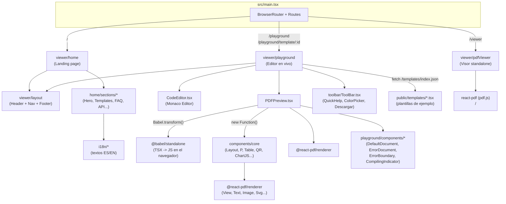

# Análisis Detallado — React PDF LevelUp (Frontend)

> Informe técnico generado a partir del contenido de `frontend.zip`. Describe la estructura completa del proyecto, la función de cada archivo/carpeta y cómo se conectan entre sí.
>
> **Actualización (auditoría de código, `src.zip`):** esta versión corrige la sección 3 y 11.3 (la carpeta `viewer/playground` cambió de estructura: aparecieron subcarpetas `components/` y `hooks/`, y varios archivos nuevos) y añade la **sección 17**, con los bugs encontrados al revisar en detalle el código del Playground. El resto del documento (secciones 1–16) se deja igual porque el `src.zip` analizado no incluye `public/`, por lo que no fue posible reverificar las plantillas estáticas ni el resto de archivos de configuración de la raíz del proyecto.

---

## 1. Resumen ejecutivo

Este proyecto es el **frontend de "React PDF LevelUp"**, un sitio/herramienta que promociona y da soporte a una librería llamada **`@react-pdf-levelup/core`** (construida sobre `@react-pdf/renderer`) que permite generar documentos PDF usando componentes de React con sintaxis parecida a HTML (`<P>`, `<H1>`, `<Table>`, `<Row>`, `<Col6>`, etc.) en lugar de los primitivos de bajo nivel de react-pdf (`View`, `Text`, `StyleSheet`...).

El frontend cumple **tres funciones a la vez**:

1. **Landing page / marketing** (`/`) — explica qué es la librería, muestra ejemplos, plantillas, FAQ, roadmap, etc.
2. **Playground interactivo** (`/playground`) — un editor de código en vivo (Monaco Editor) con vista previa de PDF en tiempo real, al estilo CodeSandbox/StackBlitz, pero especializado en `react-pdf`.
3. **Visor de PDF standalone** (`/viewer`) — un componente reutilizable para visualizar/navegar archivos PDF ya generados.

Adicionalmente, el propio código fuente de la librería (`src/components/core`) **vive dentro de este mismo repositorio** como una copia de trabajo/demo: es lo que alimenta tanto la vista previa del Playground como los ejemplos de la home.

Es una SPA construida con **React 18/19 + Vite + TypeScript + TailwindCSS v4 + react-router-dom v7**, con soporte de internacionalización (i18next, ES/EN).

---

## 2. Stack tecnológico

| Categoría | Tecnología | Uso en el proyecto |
|---|---|---|
| Framework UI | React 18/19 | Toda la SPA |
| Bundler/dev server | Vite 6 | Build, dev server, proxy a `/api` y `/docs` |
| Lenguaje | TypeScript 5.9 | Todo el código fuente |
| Estilos | Tailwind CSS v4 (`@tailwindcss/postcss`) | Sistema de diseño de la UI web (no del PDF) |
| Ruteo | `react-router-dom` v7 | 4 rutas (`/`, `/playground`, `/playground/template/:id`, `/viewer`) |
| Generación de PDF | `@react-pdf/renderer` v4 | Motor real de renderizado de PDF |
| Visor de PDF | `react-pdf` (pdf.js) | Componente `/viewer` |
| Editor de código | `@monaco-editor/react` | Editor del Playground |
| Transpilación en vivo | `@babel/standalone` | Compila JSX/TSX escrito por el usuario en el navegador |
| i18n | `i18next`, `react-i18next`, `i18next-browser-languagedetector` | Textos ES/EN de la home |
| QR | `qrcode`, `qr-code-styling` | Componentes `<QR>` y `<QRstyle>` del core |
| Gráficos | `chart.js`, `chartjs-node-canvas` | Componente `<ChartJS>` del core |
| Componentes UI | Radix UI + patrón "shadcn/ui" | `src/components/ui/*` |
| Utilidades CSS | `clsx`, `tailwind-merge`, `class-variance-authority` | Función `cn()` y variantes de botones |
| Iconos | `lucide-react` (UI web) y `lucide` (paquete "crudo", para el componente `<Icon>` dentro del PDF) | |
| Canvas server-side | `canvas`, `jsdom` | Soporte para generar QR/gráficos fuera del navegador (Node) |

El `package.json` declara `@react-pdf/renderer` y `react`/`react-dom` como **peerDependencies**, y además depende de `@react-pdf-levelup/core` (el paquete publicado en npm). Esto confirma que este repo es el sitio de demostración/documentación de esa librería, aunque también mantiene una copia local del código fuente de los componentes (ver sección 7).

---

## 3. Estructura de carpetas

```
frontend/
├── index.html                     # HTML raíz + SEO/OG/Twitter meta + GA
├── package.json                   # Scripts y dependencias
├── vite.config.ts                 # Config de Vite (alias "@", proxy /api y /docs)
├── tsconfig.json                  # Config de TypeScript (paths "@/*" y "@pdf/*")
├── tailwind.config.js             # Paleta de colores + safelist de clases
├── postcss.config.js              # Plugin de Tailwind v4 para PostCSS
├── types.d.ts                     # Tipado de módulos especiales (@babel/standalone, *.pdf)
│
├── public/                        # Estáticos servidos tal cual (no incluido en src.zip, sin reverificar)
│   ├── asset/
│   ├── iconos/
│   ├── imgTemplates/
│   ├── robots.txt
│   └── templates/
│       ├── index.json
│       ├── Default.tsx
│       ├── certificate.tsx
│       ├── Charts.tsx
│       ├── QR.tsx
│       ├── tablasTemplateBasico.tsx
│       ├── Etiquetas.tsx
│       └── facturas/
│           ├── Factura.tsx
│           └── facturaInvoice.tsx
│
└── src/
    ├── main.tsx                   # Entry point: ReactDOM.createRoot + rutas
    ├── styles/index.css           # Tailwind + variables CSS del tema (HSL, shadcn-style)
    ├── lib/utils.ts               # Función cn() (clsx + tailwind-merge)
    │
    ├── functions/                 # Utilidades para trabajar con PDFs ya generados
    │   ├── index.ts
    │   ├── generatePDF.ts
    │   ├── decodeBase64Pdf.ts
    │   └── printBase64Pdf.ts
    │
    ├── i18n/                      # Internacionalización (ES/EN) de la landing page
    │   ├── index.ts
    │   └── home/
    │
    ├── components/
    │   ├── core/                  # ⭐ LA LIBRERÍA react-pdf-levelup (código fuente local)
    │   │   ├── index.tsx
    │   │   ├── basic/
    │   │   │   ├── layout/
    │   │   │   ├── Etiquetas.tsx
    │   │   │   ├── Grid.tsx
    │   │   │   ├── Tablet.tsx
    │   │   │   ├── Form.tsx
    │   │   │   ├── Position.tsx
    │   │   │   ├── Img.tsx
    │   │   │   ├── ImgBg.tsx
    │   │   │   └── Lista.tsx
    │   │   ├── qr/
    │   │   ├── charts/
    │   │   └── icono/Icon.tsx
    │   │
    │   ├── ui/
    │   │
    │   └── viewer/
    │       ├── layout/
    │       ├── home/
    │       ├── playground/         # ⚠️ ESTRUCTURA ACTUALIZADA — ver detalle abajo
    │       └── pdfViewer/
```

### 3.1 Estructura actualizada de `src/components/viewer/playground/`

Esta es la parte que cambió respecto a la versión anterior del informe. Ya no es un conjunto de archivos sueltos: los componentes de presentación (documentos de error/estado y el aviso móvil) se movieron a una subcarpeta `components/`, y aparecieron tres archivos nuevos que antes no existían (`ErrorBoundary.tsx`, `DefaultDocument.tsx`, `CompilingIndicator.tsx`):

```
playground/
├── index.tsx                       # Orquestador (Editor)
├── CodeEditor.tsx                  # Wrapper de Monaco + sanitización + autocompletado
├── PDFPreview.tsx                  # Motor de compilación en vivo (Babel + new Function)
│
├── components/                     # 🆕 Antes estos archivos vivían sueltos en playground/
│   ├── ErrorBoundary.tsx           # 🆕 Class component: atrapa errores de render de React
│   ├── ErrorDocument.tsx           # (Se movió aquí; antes estaba en playground/ directo)
│   ├── DefaultDocument.tsx         # 🆕 PDF de bienvenida ("Esperando código...") mostrado en el estado inicial
│   ├── CompilingIndicator.tsx      # 🆕 Badge "Compilando..." mostrado durante el debounce
│   └── MobileWarning.tsx           # (Se movió aquí; antes estaba en playground/ directo)
│
├── hooks/
│   └── useMobileDetection.ts       # Sin cambios de contenido relevantes
│
├── toolbar/
│   ├── ToolBar.tsx
│   ├── QuickHelp.tsx               # ~729 líneas (antes 728, prácticamente sin cambio de tamaño)
│   ├── ColorPicker.tsx
│   └── funciones/
│       └── dowloadTemplate.ts
│
└── utils/
    └── templateLoader.ts           # Sin cambios relevantes
```

**Cambios funcionales relevantes que acompañan esta reorganización de carpetas:**

- **`PDFPreview.tsx`** ya no maneja "loading"/"error" con estados locales sueltos: ahora delega en tres componentes de presentación separados (`DefaultDocument`, `ErrorDocument`, `CompilingIndicator`) y en una clase `ErrorBoundary` dedicada que envuelve al `<PDFViewer>` para atrapar errores que ocurren *durante el render de React* (a diferencia de los errores de Babel o de `new Function`, que ya se atrapaban antes con `try/catch` normal).
- **`Header.tsx`** (en `viewer/layout/`) ahora recibe una prop `code` desde `Editor` (`<Header code={code} context="playgroud" />`), pensada aparentemente para una función futura (p. ej. compartir o previsualizar el código desde el header), pero **el componente no la usa** — ver bug #7 en la sección 17.

---

## 4. Arquitectura general (cómo se conecta todo)



**Idea central:** el `Playground` toma el texto que el usuario escribe en el editor Monaco, lo limpia de `import`/`export`, lo transpila con Babel *en el propio navegador*, lo ejecuta con `new Function(...)` inyectándole como "variables globales" tanto los primitivos de `@react-pdf/renderer` como **todos** los componentes de `components/core`, y el resultado se renderiza dentro de un `<PDFViewer>` (el visor embebido que trae `@react-pdf/renderer`). Así el usuario ve el PDF actualizarse mientras escribe, sin necesidad de un backend.

---

## 5. Punto de entrada y enrutamiento

*(sin cambios respecto a la versión anterior del informe)*

### `index.html`
HTML raíz con metadatos SEO completos (Open Graph, Twitter Card, JSON-LD `SoftwareApplication`, favicons, Google Analytics vía `gtag.js`). Carga `src/main.tsx` como módulo ES.

### `src/main.tsx`
```tsx
<BrowserRouter>
  <Routes>
    <Route path="/" element={<Home />} />
    <Route path="/playground" element={<Playground />} />
    <Route path="/playground/template/:templateId" element={<Playground />} />
    <Route path="/viewer" element={<PdfViewer />} />
  </Routes>
</BrowserRouter>
```

---

## 6. Configuración del proyecto

*(sin cambios; no se pudo reverificar porque `src.zip` no incluye `vite.config.ts`, `tsconfig.json`, `package.json`, etc. — solo la carpeta `src/`)*

---

## 7. El core: la librería de componentes `react-pdf-levelup`

*(estructura y componentes sin cambios respecto al informe anterior; se reverificaron nombres exportados en `src/components/core/index.tsx` y coinciden con lo documentado, con la salvedad del bug de nomenclatura de `QRstyle` descrito en la sección 17)*

---

## 8. Funciones utilitarias (`src/functions/`)

*(sin cambios: `printBase64Pdf.ts` sigue sin reexportarse desde `functions/index.ts` ni desde `core/index.tsx`)*

---

## 9. Internacionalización (`src/i18n/`)

*(sin cambios)*

---

## 10. Componentes UI genéricos (`src/components/ui/`)

*(sin cambios)*

---

## 11. Capa "viewer" — las páginas de la aplicación

### 11.1 `viewer/layout/`

*(sin cambios funcionales; ver nota sobre la prop `code` no usada en `Header.tsx`, sección 3.1 y bug #7)*

### 11.2 `viewer/home/`

*(sin cambios)*

### 11.3 `viewer/playground/` — el editor en vivo (el corazón interactivo, ACTUALIZADO)

Ver la sección 3.1 para el árbol de carpetas actualizado. El flujo general descrito en la versión anterior del informe **sigue siendo correcto**, con las siguientes precisiones tras revisar el código actual línea por línea:

**`index.tsx` (componente `Editor`)**: sin cambios de lógica respecto a lo documentado (carga plantilla por URL → `localStorage` → plantilla `"default"`; guarda en `localStorage` solo cuando no hay `:templateId` en la URL, para no pisar el progreso del usuario al visitar una plantilla). Importa `MobileWarning` desde la nueva ruta `./components/MobileWarning`.

**`PDFPreview.tsx`**: el pipeline de compilación (limpiar imports/exports → detectar componente exportado → `Babel.transform` con presets `typescript` + `react` → `new Function` con `React` y `CoreComponents` inyectados) es el mismo que antes, pero ahora:
- Usa un `ErrorBoundary` (clase, en `components/ErrorBoundary.tsx`) alrededor de `<PDFViewer>` para atrapar errores que ocurren durante el **render** de React (no durante Babel/`new Function`, que ya tenían su propio `try/catch`).
- Usa `DefaultDocument` (en `components/DefaultDocument.tsx`) como estado inicial en vez de un componente inline.
- Usa `CompilingIndicator` (en `components/CompilingIndicator.tsx`) como badge flotante mientras `isCompiling === true`.
- La lista de "componentes inyectables" se sigue calculando dinámicamente con `Object.keys(CoreComponents).filter(key => typeof ... === "function" || typeof ... === "object")` — el filtro por `"object"` es necesario porque `Img` e `Icon` están envueltos en `React.memo()`, cuyo resultado es de tipo `object` en JavaScript, no `function`; sin ese `"object"` en el filtro, ambos componentes quedarían fuera del scope inyectado y el código del usuario no podría usarlos.

**`CodeEditor.tsx`**: sin cambios de arquitectura; ver bug #2 en la sección 17 sobre un snippet de autocompletado con el nombre de componente mal escrito.

**`toolbar/*`**: sin cambios de arquitectura; ver bugs #1, #3, #4 y #5 en la sección 17.

### 11.4 `viewer/pdfViewer/`

*(sin cambios)*

---

## 12. Recursos estáticos (`public/`)

*(no incluido en `src.zip`; esta sección no pudo reverificarse en esta auditoría y se mantiene tal cual estaba, a título informativo)*

---

## 13. Flujo completo: de código escrito a PDF visible (paso a paso)

*(sigue siendo correcto; ver sección 11.3 para las precisiones sobre los componentes de presentación usados en cada paso)*

---

## 14. Relación con el paquete npm `@react-pdf-levelup/core`

*(sin cambios)*

---

## 15. Observaciones, inconsistencias y posibles mejoras detectadas (informe original)

*(se mantienen tal cual del informe anterior; ver sección 17 para los hallazgos nuevos de esta auditoría, centrada en el Playground)*

1. **Prop `showPageNumbers` inexistente** en plantillas públicas y en un snippet antiguo de autocompletado (no se pudo reverificar contra `public/templates/*.tsx` en este `src.zip`; en el `CodeEditor.tsx` actual el snippet de `Layout` ya usa correctamente `pagination={true}`, ver sección 17).
2. **Typo consistente `"playgroud"`** como valor de `context`, ver también nota en la sección 3.1 sobre la prop `code` no usada.
3. **`printBase64Pdf.ts` no está conectado.**
4. **`public/templates/Etiquetas.tsx` está vacío** (sin reverificar en este `src.zip`).
5. **Alias `@pdf/*` declarado pero sin carpeta correspondiente** (sin reverificar, `tsconfig.json` no está en este `src.zip`).
6. **Referencias a un monorepo externo** (sin reverificar).
7. **Script `demo` roto de forma aislada** (sin reverificar).
8. **Sin configuración de ESLint incluida** (sin reverificar).
9. **Secciones de marketing "en pausa"** (sin reverificar).
10. **Persistencia inconsistente entre herramientas del Playground** (confirmado: `ColorPicker.tsx` sigue usando una variable de módulo en memoria — `sharedRecentColors` — para los colores recientes, mientras que el código del editor sí persiste en `localStorage`).

---

## 16. Cómo ejecutar el proyecto

*(sin cambios)*

---

## 17. 🐞 Bugs encontrados en el Playground (auditoría de código, `src.zip`)

Esta sección es nueva. Se revisó línea por línea todo `src/components/viewer/playground/**` y sus dependencias directas (`src/components/core/index.tsx`, `src/components/viewer/layout/Header.tsx`). Los hallazgos están ordenados de mayor a menor impacto para el usuario final del Playground.

### Bug #1 — `QRstyle` vs `QRStyle`: casing incorrecto en `QuickHelp.tsx` y `dowloadTemplate.ts`

El componente real, exportado por `src/components/core/index.tsx`, se llama **`QRstyle`** (con "s" minúscula):

```ts
// src/components/core/index.tsx
import QRstyle from "./qr/QRstyle"
export { ..., QRstyle, ... }
```

Sin embargo:

- **`toolbar/QuickHelp.tsx`** (línea ~506 y ~546) documenta el componente como **`QRStyle`** (con "S" mayúscula) y su ejemplo de código copiable usa `<QRStyle ... />`. Cualquier usuario que pulse "Copiar" y pegue ese ejemplo en el editor obtendrá un PDF de error en vez de un QR, porque `QRStyle` nunca existe en el scope inyectado (solo existe `QRstyle`) → `new Function` lanza `QRStyle is not defined` y `PDFPreview.tsx` lo muestra como *"Error de ejecución"*.
- **`toolbar/funciones/dowloadTemplate.ts`** (línea 8) declara:
  ```ts
  qr: ['QR', 'QRStyle'],
  ```
  también con "S" mayúscula. Esto rompe la función de "Descargar" de dos maneras distintas según el código del usuario:
  1. Si el usuario escribe `<QRstyle>` correctamente (como sugiere el autocompletado de `CodeEditor.tsx`, que sí usa el casing correcto), `isComponentUsed('QRStyle', code)` nunca hace match (la comparación es sensible a mayúsculas), así que `QRstyle` **no se clasifica como componente de `qr`**.
  2. Como `QRstyle` también aparece en `libraryComponents.core` (viene de `Object.keys(ReactPdfLevelup)`, que sí tiene el casing real), y la exclusión `qrAndChartComponents.includes(component)` compara contra `'QRStyle'` (no contra `'QRstyle'`), la exclusión falla y `QRstyle` **se clasifica erróneamente como componente de `core`**.
  
  Resultado: al descargar cualquier plantilla que use `<QRstyle>`, el archivo `template.tsx` generado incluye:
  ```ts
  import { QRstyle } from "@react-pdf-levelup/core";
  ```
  en lugar de:
  ```ts
  import { QRstyle } from "@react-pdf-levelup/qr";
  ```
  Un desarrollador que instale solo `@react-pdf-levelup/qr` (y no `core`, o viceversa) en su proyecto externo se encontrará con un `import` que no resuelve.

**Fix sugerido:** cambiar `'QRStyle'` por `'QRstyle'` en ambos archivos (array `libraryComponents.qr` en `dowloadTemplate.ts`, y `name`/`example` en `QuickHelp.tsx`).

### Bug #2 — Snippet de autocompletado `Textarea` no coincide con el componente real `TextArea`

En `src/components/core/basic/Form.tsx` (y reexportado en `core/index.tsx`) el componente se llama **`TextArea`** (con "A" mayúscula en medio):

```ts
export { Form, Input, TextArea, Checkbox }
```

Pero en `CodeEditor.tsx` (línea 207), el snippet de autocompletado registrado es:

```ts
etiquetaAutoConclusiva("Textarea", 'label="$1"'),
```

con "a" minúscula ("Textarea", no "TextArea"). Cualquier usuario que escriba `Textarea` + Tab en el editor (comportamiento normal de autocompletar) obtiene una etiqueta `<Textarea label="..."/>` que, al compilarse, produce `ReferenceError: Textarea is not defined` (solo `TextArea` existe en el scope inyectado por `PDFPreview.tsx`), mostrando el PDF de error en vez del formulario esperado.

**Fix sugerido:** cambiar el `label` del snippet a `"TextArea"` en `CodeEditor.tsx` para que coincida con el nombre real exportado.

### Bug #3 — `QuickHelp.tsx` documenta un componente `Header` que no existe en `components/core`

En la pestaña **"Page"** del panel de ayuda (línea ~559-567), `QuickHelp.tsx` documenta:

```ts
{
  name: "Header",
  description: "Encabezado de página",
  props: [...],
  example: `<Header fixed>Encabezado</Header>`,
},
```

Pero `src/components/core/index.tsx` **no exporta ningún componente `Header`** (ni existe ningún archivo `Header.tsx` dentro de `components/core`). Esto es consistente con que en `CodeEditor.tsx` las entradas de autocompletado para `Header`/`Main`/`Footer` están comentadas (`//etiquetaConSalto("Header")`, etc.) — parecen ser componentes planeados pero nunca implementados. El resultado es que un usuario que confíe en la documentación embebida y escriba `<Header fixed>...</Header>` obtendrá un error de ejecución (`Header is not defined`), ya que no existe en el scope de `CoreComponents`.

**Fix sugerido:** quitar la entrada `Header` de `QuickHelp.tsx` (o implementar el componente en `core/` si el plan es soportarlo).

### Bug #4 — Prop incorrecta `lines` en el ejemplo de "Pie de página (Layout.footer)" de `QuickHelp.tsx`

En la misma pestaña "Page" (línea ~568-578):

```ts
{
  name: "Pie de página (Layout.footer)",
  props: [
    { name: "footer", ... },
    { name: "lines", type: "number", default: "1", description: "Número de líneas reservadas" },
  ],
  example: `<Layout footer={<P>Pie</P>} lines={2}>
  <P>Contenido</P>
</Layout>`,
},
```

La prop real de `Layout` (definida en `core/basic/layout/Layout.tsx`) es **`footerLines`**, no `lines`:

```ts
interface LayoutProps {
  ...
  footerLines?: number
  ...
}
```

Curiosamente, la propia pestaña "Layout" de `QuickHelp.tsx` (línea ~73) **sí documenta correctamente** `footerLines` para el mismo componente — es una inconsistencia interna del propio panel de ayuda, no solo un error aislado. Con el nombre incorrecto (`lines`), la prop simplemente se ignora en tiempo de ejecución (Babel no valida tipos), por lo que el usuario que copie este ejemplo nunca verá el efecto de reservar más espacio para el pie de página — el mismo patrón de bug silencioso que el ya documentado para `showPageNumbers` en la sección 15.

**Fix sugerido:** cambiar `lines` por `footerLines` en el ejemplo y en la tabla de props de esa entrada.

### Bug #5 — Posicionamiento roto de `CompilingIndicator` (badge "Compilando...")

`components/CompilingIndicator.tsx` usa `position: "absolute", top: 10, right: 10` esperando ubicarse en la esquina superior derecha del panel de vista previa del PDF. Pero ni `PDFPreview.tsx` (`<div style={{ width: "100%", height: "100%" }}>`, sin `position`) ni su contenedor en `index.tsx` (`<div className="w-1/2 bg-gray-100">`, sin clase `relative`) declaran una posición no estática. Como resultado, `position: absolute` en `CompilingIndicator` termina calculándose respecto al primer ancestro posicionado que exista más arriba en el árbol (o respecto al viewport si no hay ninguno), en vez de respecto al panel de vista previa. El badge puede terminar apareciendo en una esquina de la pantalla que no corresponde visualmente al panel del PDF, especialmente notorio en ventanas anchas.

**Fix sugerido:** agregar `position: "relative"` (o la clase `relative` de Tailwind) al `<div>` contenedor en `PDFPreview.tsx`.

### Bug #6 — `ToolBar` se centra respecto a todo el viewport, no respecto al panel del editor

`toolbar/ToolBar.tsx` usa `className="fixed bottom-6 left-1/2 -translate-x-1/2 z-50"`. Al ser `fixed`, esas coordenadas se calculan respecto a **toda la ventana del navegador**, ignorando que el `<ToolBar>` se renderiza dentro de `<div className="w-1/2 border-r ...">` (la mitad izquierda de la pantalla, junto al editor de código) en `index.tsx`. El resultado visual es que la barra flotante con `QuickHelp`, `ColorPicker` y el botón de "Descargar" aparece centrada en el punto medio de **toda la pantalla** (es decir, sobre el límite entre el editor y la vista previa del PDF, o incluso sobre la vista previa en pantallas anchas), en vez de quedar centrada bajo el editor de código, como sugiere su ubicación en el árbol de componentes.

**Fix sugerido:** o bien usar `absolute` dentro de un contenedor `relative` que sea el panel del editor, o ajustar manualmente el `left` (p. ej. `left-1/4` en vez de `left-1/2`) para centrar respecto a la mitad izquierda de la pantalla.

### Bug #7 — Prop `code` pasada a `Header` pero nunca usada

En `playground/index.tsx`:

```tsx
<Header code={code} context="playgroud" />
```

Pero `viewer/layout/Header.tsx` declara `code?: any` en su interfaz y **solo desestructura `{ context }`** en la firma del componente — la prop `code` se descarta silenciosamente. No es un error que rompa nada visible, pero es código muerto / cableado a medias: sugiere una funcionalidad planeada (¿compartir el código actual desde el header? ¿un botón de "ver código" en el header?) que quedó sin terminar. Vale la pena revisar la intención original o eliminar la prop no usada.

### Bug #8 (menor, cosmético) — Fallback de detección de componente en `PDFPreview.tsx` puede elegir el subcomponente equivocado

Cuando el código no tiene `export default` y no matchea ninguno de los patrones específicos, `PDFPreview.tsx` cae a:

```ts
const componentMatch = modifiedCode.match(/const\s+([A-Z][a-zA-Z0-9]*)\s*=/)
```

Esto toma el **primer** `const NombreConMayúscula = ...` que aparezca en todo el archivo. Si una plantilla define varios subcomponentes internos antes del componente principal (el informe original menciona justamente un caso así en `facturaInvoice.tsx`, con subcomponentes `Header`, `Title`, `Menu`, `FathonTablet`, `FathonFooter`) y **no** incluye un `export default` explícito, el Playground renderizaría el primer subcomponente encontrado (p. ej. `Header`) en vez del documento completo. Es un caso límite —no se dispara si el código tiene `export default`, que es lo habitual— pero vale la pena tenerlo presente si se depuran plantillas "raras" que no muestran lo esperado.

### Resumen de impacto

| # | Archivo(s) | Severidad | Efecto visible para el usuario |
|---|---|---|---|
| 1 | `QuickHelp.tsx`, `dowloadTemplate.ts` | Alta | Ejemplo de `QRStyle` copiado del panel de ayuda rompe el preview; plantillas descargadas con `QRstyle` traen el import de la librería equivocada |
| 2 | `CodeEditor.tsx` | Alta | Autocompletar `Textarea` genera código que siempre falla en el preview |
| 3 | `QuickHelp.tsx` | Media | Documentación de un componente `Header` inexistente; su ejemplo falla si se copia |
| 4 | `QuickHelp.tsx` | Media | Prop `lines` documentada no tiene efecto real (debería ser `footerLines`) |
| 5 | `CompilingIndicator.tsx` / `PDFPreview.tsx` | Baja-Media | Badge "Compilando..." puede aparecer desalineado visualmente |
| 6 | `ToolBar.tsx` | Baja-Media | Barra flotante inferior desalineada respecto al panel del editor |
| 7 | `Header.tsx` (layout) | Muy baja | Prop `code` muerta, sin efecto funcional |
| 8 | `PDFPreview.tsx` | Muy baja (caso límite) | Fallback de detección de componente podría elegir un subcomponente en vez del documento principal, solo si falta `export default` |

Ningún bug de esta lista impide el uso general del Playground (los flujos "felices" — usar los componentes tal como los sugiere el autocompletado sin aceptar el snippet de `Textarea`, no copiar el ejemplo roto de `QRStyle`/`Header`, pantallas de ancho estándar — funcionan). Son, en su mayoría, inconsistencias de *nombres* entre la documentación/herramientas auxiliares y el código real de los componentes, más dos detalles de CSS. El de mayor impacto práctico es el par **#1/#2**, porque afectan directamente al flujo de autocompletar-y-copiar que es la razón de ser del Playground.