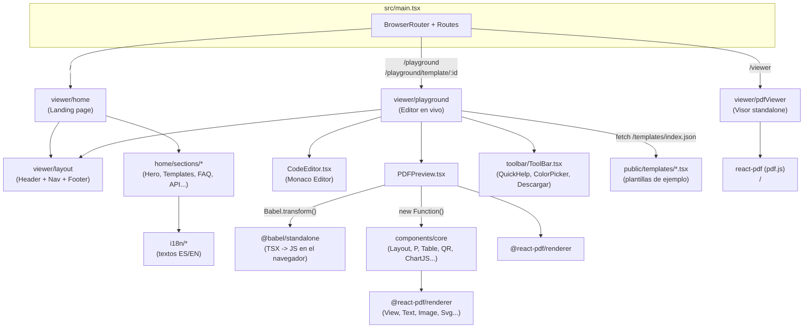

# Análisis Detallado — React PDF LevelUp (Frontend)

> Informe técnico generado a partir del contenido de `frontend.zip`. Describe la estructura completa del proyecto, la función de cada archivo/carpeta y cómo se conectan entre sí.

---

## 1. Resumen ejecutivo

Este proyecto es el **frontend de "React PDF LevelUp"**, un sitio/herramienta que promociona y da soporte a una librería llamada **`@react-pdf-levelup/core`** (construida sobre `@react-pdf/renderer`) que permite generar documentos PDF usando componentes de React con sintaxis parecida a HTML (`<P>`, `<H1>`, `<Table>`, `<Row>`, `<Col6>`, etc.) en lugar de los primitivos de bajo nivel de react-pdf (`View`, `Text`, `StyleSheet`...).

El frontend cumple **tres funciones a la vez**:

1. **Landing page / marketing** (`/`) — explica qué es la librería, muestra ejemplos, plantillas, FAQ, roadmap, etc.
2. **Playground interactivo** (`/playground`) — un editor de código en vivo (Monaco Editor) con vista previa de PDF en tiempo real, al estilo CodeSandbox/StackBlitz, pero especializado en `react-pdf`.
3. **Visor de PDF standalone** (`/viewer`) — un componente reutilizable para visualizar/navegar archivos PDF ya generados.

Adicionalmente, el propio código fuente de la librería (`src/components/core`) **vive dentro de este mismo repositorio** como una copia de trabajo/demo: es lo que alimenta tanto la vista previa del Playground como los ejemplos de la home.

Es una SPA construida con **React 18/19 + Vite + TypeScript + TailwindCSS v4 + react-router-dom v7**, con soporte de internacionalización (i18next, ES/EN).

---

## 2. Stack tecnológico

| Categoría | Tecnología | Uso en el proyecto |
|---|---|---|
| Framework UI | React 18/19 | Toda la SPA |
| Bundler/dev server | Vite 6 | Build, dev server, proxy a `/api` y `/docs` |
| Lenguaje | TypeScript 5.9 | Todo el código fuente |
| Estilos | Tailwind CSS v4 (`@tailwindcss/postcss`) | Sistema de diseño de la UI web (no del PDF) |
| Ruteo | `react-router-dom` v7 | 4 rutas (`/`, `/playground`, `/playground/template/:id`, `/viewer`) |
| Generación de PDF | `@react-pdf/renderer` v4 | Motor real de renderizado de PDF |
| Visor de PDF | `react-pdf` (pdf.js) | Componente `/viewer` |
| Editor de código | `@monaco-editor/react` | Editor del Playground |
| Transpilación en vivo | `@babel/standalone` | Compila JSX/TSX escrito por el usuario en el navegador |
| i18n | `i18next`, `react-i18next`, `i18next-browser-languagedetector` | Textos ES/EN de la home |
| QR | `qrcode`, `qr-code-styling` | Componentes `<QR>` y `<QRstyle>` del core |
| Gráficos | `chart.js`, `chartjs-node-canvas` | Componente `<ChartJS>` del core |
| Componentes UI | Radix UI + patrón "shadcn/ui" | `src/components/ui/*` |
| Utilidades CSS | `clsx`, `tailwind-merge`, `class-variance-authority` | Función `cn()` y variantes de botones |
| Iconos | `lucide-react` (UI web) y `lucide` (paquete "crudo", para el componente `<Icon>` dentro del PDF) | |
| Canvas server-side | `canvas`, `jsdom` | Soporte para generar QR/gráficos fuera del navegador (Node) |

El `package.json` declara `@react-pdf/renderer` y `react`/`react-dom` como **peerDependencies**, y además depende de `@react-pdf-levelup/core` (el paquete publicado en npm). Esto confirma que este repo es el sitio de demostración/documentación de esa librería, aunque también mantiene una copia local del código fuente de los componentes (ver sección 7).

---

## 3. Estructura de carpetas

```
frontend/
├── index.html                     # HTML raíz + SEO/OG/Twitter meta + GA
├── package.json                   # Scripts y dependencias
├── vite.config.ts                 # Config de Vite (alias "@", proxy /api y /docs)
├── tsconfig.json                  # Config de TypeScript (paths "@/*" y "@pdf/*")
├── tailwind.config.js             # Paleta de colores + safelist de clases
├── postcss.config.js              # Plugin de Tailwind v4 para PostCSS
├── types.d.ts                     # Tipado de módulos especiales (@babel/standalone, *.pdf)
│
├── public/                        # Estáticos servidos tal cual
│   ├── asset/                     # Imágenes de marketing (wallpaper, certificado.png)
│   ├── iconos/                    # Favicons
│   ├── imgTemplates/              # Miniaturas de las plantillas mostradas en la home
│   ├── robots.txt
│   └── templates/                 # Plantillas de ejemplo (código fuente "crudo")
│       ├── index.json             # Catálogo de plantillas (id, nombre, path)
│       ├── Default.tsx
│       ├── certificate.tsx
│       ├── Charts.tsx
│       ├── QR.tsx
│       ├── tablasTemplateBasico.tsx
│       ├── Etiquetas.tsx          # (archivo vacío, sin uso)
│       └── facturas/
│           ├── Factura.tsx
│           └── facturaInvoice.tsx
│
└── src/
    ├── main.tsx                   # Entry point: ReactDOM.createRoot + rutas
    ├── styles/index.css           # Tailwind + variables CSS del tema (HSL, shadcn-style)
    ├── lib/utils.ts               # Función cn() (clsx + tailwind-merge)
    │
    ├── functions/                 # Utilidades para trabajar con PDFs ya generados
    │   ├── index.ts
    │   ├── generatePDF.ts         # Renderiza un componente a stream -> base64 (Node/SSR)
    │   ├── decodeBase64Pdf.ts     # Descarga/abre un PDF en base64 en el navegador
    │   └── printBase64Pdf.ts      # Imprime un PDF en base64 vía <iframe> oculto
    │
    ├── i18n/                      # Internacionalización (ES/EN) de la landing page
    │   ├── index.ts               # Inicializa i18next combinando todos los namespaces
    │   └── home/                  # Un archivo por sección de la home (hero, faq, nav...)
    │
    ├── components/
    │   ├── core/                  # ⭐ LA LIBRERÍA react-pdf-levelup (código fuente local)
    │   │   ├── index.tsx          # Barrel: reexporta todos los componentes + react-pdf
    │   │   ├── basic/
    │   │   │   ├── layout/        # Layout, LayoutMultiPage, NextPage + helpers
    │   │   │   ├── Etiquetas.tsx  # P, H1-H6, Strong, Em, U, Small, Blockquote, Mark, A, BR, HR, Span, Div
    │   │   │   ├── Grid.tsx       # Container, Row, Col1-Col12 (grid tipo Bootstrap)
    │   │   │   ├── Tablet.tsx     # Table, Thead, Tbody, Tr, Th, Td
    │   │   │   ├── Form.tsx       # Form, Input, TextArea, Checkbox (visuales, no funcionales)
    │   │   │   ├── Position.tsx   # Left, Right, Center
    │   │   │   ├── Img.tsx        # Imagen simple
    │   │   │   ├── ImgBg.tsx      # Imagen de fondo con contenido superpuesto
    │   │   │   └── Lista.tsx      # UL, OL, LI
    │   │   ├── qr/                 # QR, QRstyle + generadores (canvas/base64)
    │   │   ├── charts/              # ChartJS + generador con chart.js sobre <canvas>
    │   │   └── icono/Icon.tsx      # Convierte iconos de "lucide" a <Svg>/<Path> de react-pdf
    │   │
    │   ├── ui/                    # Primitivos de UI (patrón shadcn/ui sobre Radix)
    │   │   ├── button.tsx, card.tsx, input.tsx, select.tsx, tabs.tsx,
    │   │   │   accordion.tsx, badge.tsx, popover.tsx, scroll-area.tsx, tooltip.tsx
    │   │
    │   └── viewer/                 # Las 3 "páginas" de la SPA + su layout compartido
    │       ├── layout/            # Header, Navegacion (dock flotante), TemplateSelector
    │       ├── home/               # Landing page (index.tsx + sections/*)
    │       ├── playground/         # Editor en vivo (index.tsx + subcomponentes)
    │       └── pdfViewer/          # Visor de PDF standalone (index.tsx)
```

---

## 4. Arquitectura general (cómo se conecta todo)



**Idea central:** el `Playground` toma el texto que el usuario escribe en el editor Monaco, lo limpia de `import`/`export`, lo transpila con Babel *en el propio navegador*, lo ejecuta con `new Function(...)` inyectándole como "variables globales" tanto los primitivos de `@react-pdf/renderer` como **todos** los componentes de `components/core`, y el resultado se renderiza dentro de un `<PDFViewer>` (el visor embebido que trae `@react-pdf/renderer`). Así el usuario ve el PDF actualizarse mientras escribe, sin necesidad de un backend.

---

## 5. Punto de entrada y enrutamiento

### `index.html`
HTML raíz con metadatos SEO completos (Open Graph, Twitter Card, JSON-LD `SoftwareApplication`, favicons, Google Analytics vía `gtag.js`). Carga `src/main.tsx` como módulo ES.

### `src/main.tsx`
```tsx
<BrowserRouter>
  <Routes>
    <Route path="/" element={<Home />} />
    <Route path="/playground" element={<Playground />} />
    <Route path="/playground/template/:templateId" element={<Playground />} />
    <Route path="/viewer" element={<PdfViewer />} />
  </Routes>
</BrowserRouter>
```
Importa también `./styles/index.css` (Tailwind) y `./i18n` (side-effect: inicializa i18next antes de renderizar). Envuelve todo en `<StrictMode>`.

Solo existen **4 rutas**, todas mapeadas 1:1 a las 3 "páginas" dentro de `components/viewer` (Playground se usa dos veces: sin plantilla, y con `:templateId` para precargar una plantilla específica desde la home).

---

## 6. Configuración del proyecto

- **`vite.config.ts`**: define el alias `@` → `./src` (usado en casi todos los imports). Configura un **proxy de desarrollo**: `/api` → `http://localhost:4000` y `/docs` → `http://localhost:4500`. Esto revela que el frontend forma parte de un **monorepo** más grande, con un backend/API y un sitio de documentación corriendo como servicios separados (no incluidos en este zip). También activa `babel-plugin-react-compiler` (el nuevo compilador optimizador de React) vía el plugin `@vitejs/plugin-react`.
- **`tsconfig.json`**: además del alias `@/*` → `src/*`, define `@pdf/*` → `src/pdf/*`, una carpeta que **no existe** en este zip (posible resto de una reestructuración, o path reservado para el futuro). También incluye en `include` la ruta `../api/src/useExample`, confirmando de nuevo la existencia de un proyecto hermano `api/` fuera de este zip.
- **`tailwind.config.js`**: define una paleta de colores custom en formato `rgb(<v> / <alpha-value>)` (background, foreground, primary, accent, etc., pensada para tema oscuro) y una `safelist` extensa de utilidades (para que Tailwind no elimine clases usadas dinámicamente, por ejemplo dentro de código generado en runtime).
- **`postcss.config.js`**: solo activa el plugin `@tailwindcss/postcss` (Tailwind v4 ya no necesita `autoprefixer` explícito en el pipeline PostCSS).
- **`types.d.ts`**: declara tipos para el módulo `@babel/standalone` (que no trae tipados propios) y permite importar archivos `*.pdf` como string.
- **`package.json`** — scripts:
  - `dev`: `vite --host 0.0.0.0 --port 3000`
  - `build`: `tsc -b && vite build`
  - `lint`: `eslint .` (⚠️ no se encontró ningún `eslint.config.js` en el zip, así que este script fallaría tal cual está)
  - `start`: `vite preview --host 0.0.0.0 --port 8888`
  - `demo`: `tsx ./src/useExample/index.ts` (⚠️ esa carpeta tampoco existe en este zip; es coherente con la referencia a `../api/src/useExample` del `tsconfig.json` — parece un script pensado para ejecutarse desde la raíz del monorepo, no desde `frontend/` de forma aislada).

---

## 7. El core: la librería de componentes `react-pdf-levelup`

Esta es la parte más importante del proyecto. Vive en `src/components/core` y es una **copia de trabajo local** de lo que se publica como el paquete npm `@react-pdf-levelup/core` (y sus paquetes hermanos `@react-pdf-levelup/qr`, `@react-pdf-levelup/chart`, mencionados en `dowloadTemplate.ts`). Todos estos componentes son wrappers de alto nivel sobre los primitivos de `@react-pdf/renderer` (`View`, `Text`, `Image`, etc.), pensados para escribirse con una sintaxis parecida a HTML/Bootstrap.

### 7.1 `basic/layout/` — el "documento"

- **`Layout.tsx`**: es el componente raíz de cualquier plantilla de una sola sección. Envuelve internamente un `<Document>` + `<Page>` de react-pdf. Gestiona:
  - `size` (A4, LETTER, LEGAL... hasta formatos ISO poco comunes como `4A0`/`RA0`, mapeados en puntos PDF en `getPageDimensions.ts`).
  - `orientation` (acepta sinónimos: `vertical`/`v`/`portrait` y `horizontal`/`h`/`landscape`, normalizados en `toPdfOrientation.ts`).
  - `margin` (presets `apa`/`normal`/`estrecho`/`ancho`, calculados en mm→puntos en `getMargins.ts`) o `padding` numérico manual.
  - `backgroundColor`, `backgroundImage` (+ opacidad), un **footer** con numeración de página automática (`pageNumber / totalPages`), y una **rejilla de depuración** (`rule={true}`) que dibuja líneas cada cm para alinear elementos visualmente.
  - Metadatos del PDF (`title`, `author`, `subject`, etc. vía prop `meta`).
  - Valida y sanea props inválidas con `console.warn` + fallback (p. ej. un tamaño de página desconocido cae a "A4").

- **`LayoutMultiPage.tsx`**: variante para documentos de **varias páginas con configuración distinta por página**. Expone `LayoutMultiPage` (el documento) y `Section` (cada página). `LayoutMultiPage` inyecta props globales (`__global*`) en cada `<Section>` hijo vía `React.cloneElement`, y cada `Section` puede sobreescribir localmente cualquier valor (color de fondo, margen, footer, etc.), resolviendo "local > global" con el helper `resolve()`.

- **`NextPage.tsx`**: componente de una línea (`<View break />`) para forzar un salto de página dentro de un `Layout` normal (de una sola `Page`).

- **`helper/`**: tres módulos puros sin JSX:
  - `getPageDimensions.ts` — diccionario con las dimensiones en puntos (72dpi) de ~40 formatos de papel (serie A, B, C, RA, SRA, Legal, Letter, Tabloid, ID1, etc.).
  - `getMargins.ts` — convierte presets de margen a puntos PDF (mm × 2.834645669).
  - `toPdfOrientation.ts` — normaliza sinónimos de orientación al vocabulario que entiende react-pdf (`portrait`/`landscape`).

### 7.2 `basic/Etiquetas.tsx` — "HTML" para texto
Exporta `P, H1-H6, Strong, Em, U, Small, Blockquote, Mark, A, BR, HR, Span, Div`. Todos son wrappers delgados sobre `Text`/`Link`/`View` de react-pdf con un `StyleSheet` propio (tamaños de fuente, negritas, subrayado, etc.), que además hacen *merge* del `style` que el usuario pase (`style={[stylesBase, styleUsuario]}`).

### 7.3 `basic/Grid.tsx` — sistema de rejilla tipo Bootstrap
`Container`, `Row` (`flexDirection: row` + `wrap`) y `Col1`…`Col12`, cada uno con un ancho porcentual fijo (`col6` = 50%, etc.). Permite maquetar layouts en columnas como en Bootstrap.

### 7.4 `basic/Tablet.tsx` — tablas
`Table, Thead, Tbody, Tr, Th, Td`, implementadas con **Context API de React** (`TableContext`) para propagar `borderColor`, `textColor`, `headerBackground`, color de cebra (`zebraColor`) y `cellHeight` a todas las celdas sin tener que repetirlos manualmente. Soporta dos modos visuales (`grid` prop: `"grid"` con bordes completos estilo Excel, o `"modern"` solo con línea inferior). `Tbody` clona sus `<Tr>` hijos para marcar la última fila (`isLastRow`) y las filas impares (`isOdd`, para el efecto cebra); `Tr` a su vez clona sus celdas para repartirles el ancho equitativamente y marcar cuál es la última columna (para no dibujarle borde derecho).

### 7.5 `basic/Form.tsx` — formularios (solo visuales)
`Form, Input, TextArea, Checkbox`. Importante: como un PDF no tiene campos interactivos reales en este contexto, estos son **representaciones visuales estáticas** de un formulario (cajas con placeholder y checkbox marcado/desmarcado), útiles para maquetar documentos que simulan formularios impresos.

### 7.6 `basic/Position.tsx`
`Left`, `Right`, `Center` — contenedores (`View`) que alinean su contenido horizontal (y opcionalmente vertical, con `vertical={true}`).

### 7.7 `basic/Img.tsx` y `basic/ImgBg.tsx`
- `Img`: wrapper memoizado de `Image` con estilo por defecto `width:100%, height:auto`.
- `ImgBg`: imagen de fondo posicionada en `absolute` (`top/left/right/bottom: 0`) con `opacity`, `objectFit` y `objectPosition` configurables, y un `<View>` de contenido superpuesto encima — es el patrón usado por la plantilla de certificado (sección 12).

### 7.8 `basic/Lista.tsx`
`UL`, `OL`, `LI`. Soporta viñetas (`disc`, `circle`, `square`) y numeración (`decimal`, `lower-alpha`, `upper-alpha`, `lower-roman`, `upper-roman` — con una función propia `toRoman()` para convertir números a numerales romanos). `UL`/`OL` clonan cada `<LI>` hijo inyectándole el tipo de viñeta y su índice.

### 7.9 `qr/` — códigos QR
- **`QR.tsx`**: genera un QR simple a partir de una `url`, con color de módulos/fondo, margen, nivel de corrección de errores (`L/M/Q/H`) y logo central opcional. Usa `qrcode` (`QRCode.toDataURL`) para generar el PNG en base64 (`QRGenerator.ts`), y si hay un logo, lo compone encima usando un `<canvas>` (en navegador) o el paquete `canvas` (en Node/SSR) — con fallback a la API pública `api.qrserver.com` si algo falla.
- **`QRstyle.tsx`** + **`QRstyleGenerator.ts`**: variante que usa `qr-code-styling` para QRs con estilos avanzados (puntos redondeados, esquinas personalizadas, gradientes, etc.) — como se ve en el snippet de autocompletado del editor (`dotsOptions`, `cornersSquareOptions`, `cornersDotOptions`...).

### 7.10 `charts/` — gráficos
- **`ChartJSGenerator.ts`**: crea un `<canvas>` en memoria, registra Chart.js dinámicamente (`import("chart.js")`, lazy) y renderiza cualquier `ChartConfiguration` de Chart.js a una imagen PNG en base64, con caché en memoria (`Map`) por configuración+dimensiones para no re-renderizar gráficos idénticos.
- **`ChartJS.tsx`**: componente React que llama al generador en un `useEffect`, maneja tres estados (`loading`/`success`/`error`) y finalmente inserta la imagen resultante como `<Image>` de react-pdf (ya que react-pdf no puede renderizar un `<canvas>` interactivo dentro del PDF final, solo imágenes).

### 7.11 `icono/Icon.tsx`
Puente entre la librería **`lucide`** (no `lucide-react`, sino el paquete "crudo" que expone los iconos como arrays de nodos SVG) y los primitivos SVG de `@react-pdf/renderer` (`Svg`, `Path`, `G`, `Circle`, `Rect`, `Line`, `Ellipse`, `Polygon`, `Polyline`). Convierte el nombre del icono (p. ej. `ico="check-circle"` o `CheckCircle`) a su representación interna y la dibuja como vectores reales dentro del PDF (no como imagen rasterizada), preservando nitidez a cualquier escala.

### 7.12 `index.tsx` — barrel de exportación
Reexporta **todos** los componentes anteriores más los primitivos de `@react-pdf/renderer` que la librería "hereda" tal cual (`PDFViewer`, `Document`, `Page`, `Text`, `View`, `StyleSheet`, `Font`, `Image`, `Link`, `Svg`, `Defs`, `Rect`, `LinearGradient`, `Stop`, `G`, `renderToStream`, `Canvas`, `Polygon`, `ClipPath`) y las funciones utilitarias (`decodeBase64Pdf`, `generatePDF`, ver sección 8). Este archivo es lo que se importa como `import * as CoreComponents from "@/components/core"` dentro de `PDFPreview.tsx`, y es también la fuente para detectar qué componentes usar al generar el "template descargable" en `dowloadTemplate.ts`.

---

## 8. Funciones utilitarias (`src/functions/`)

| Archivo | Propósito | Contexto de uso |
|---|---|---|
| `generatePDF.ts` | Recibe un `template` (componente React) y `data`, lo renderiza con `renderToStream` (server-side/Node) y devuelve el PDF completo como **string base64** | Pensado para uso en backend/SSR (Node), reexportado también desde `core/index.tsx` para quien consuma la librería |
| `decodeBase64Pdf.ts` | Convierte un base64 a `Blob`, crea un enlace `<a download>` para descargarlo **y además** lo abre en una pestaña nueva (`window.open`) | Uso en navegador, para cuando el PDF llega como base64 desde una API |
| `printBase64Pdf.ts` | Convierte un base64 a `Blob`, lo inyecta en un `<iframe>` oculto y llama a `contentWindow.print()` | Uso en navegador para imprimir directamente. **No está reexportado** en `functions/index.ts` ni en `core/index.tsx` — parece código disponible pero no conectado al resto de la app todavía |
| `index.ts` | Barrel que reexporta `decodeBase64Pdf` y `generatePDF` | Consumido por `components/core/index.tsx` |

---

## 9. Internacionalización (`src/i18n/`)

- **`index.ts`** inicializa `i18next` con `LanguageDetector` (detecta el idioma del navegador) y `initReactI18next`, combinando en un solo objeto `resources.es.translation` / `resources.en.translation` el contenido de **10 archivos**, uno por sección de la home: `hero`, `value`, `templates`, `how`, `dev`, `use`, `api`, `roadmap`, `support`, `faq`, `nav`.
- Cada archivo en `i18n/home/*.ts` exporta un objeto con la forma:
  ```ts
  export const hero = {
    es: { translation: { hero: { badge: "...", title_start: "...", ... } } },
    en: { translation: { hero: { badge: "...", title_start: "...", ... } } },
  }
  ```
  Es decir, **cada namespace de texto está anidado bajo su propia clave** (`hero.badge`, `templates.title`, `nav.home`, etc.), lo cual permite usarlo directamente como `t("hero.badge")` desde cualquier componente con `useTranslation()`.
- El cambio de idioma en vivo lo dispara el componente `Navegacion.tsx` (botones **ES**/**EN** en el dock flotante) llamando a `i18n.changeLanguage("es"|"en")`.
- **Nota:** solo la *landing page* (`home/sections/*`) usa estas traducciones. El Playground, sus plantillas y la documentación del `QuickHelp` están **hardcodeados en español**.

---

## 10. Componentes UI genéricos (`src/components/ui/`)

Son los primitivos de interfaz típicos del patrón **shadcn/ui**: pequeños wrappers sobre **Radix UI** (`@radix-ui/react-*`) con estilos de Tailwind y variantes gestionadas con `class-variance-authority` (`cva`). Incluye: `button`, `card`, `input`, `select`, `tabs`, `accordion`, `badge`, `popover`, `scroll-area`, `tooltip`. Se usan tanto en la home (botones, badges, tarjetas de FAQ tipo accordion) como en el Playground (`Select` del `TemplateSelector`, `Input` del `ColorPicker`, `Button` de `Navegacion`/`MobileWarning`) y en el visor (`Button`, `Input` de paginación en `pdfViewer`). La función `cn()` de `lib/utils.ts` (combinación de `clsx` + `tailwind-merge`) es la que todos usan internamente para fusionar clases de Tailwind sin colisiones.

---

## 11. Capa "viewer" — las páginas de la aplicación

### 11.1 `viewer/layout/` — cascarón compartido

- **`index.tsx` (`Layout`)**: envuelve el contenido de cada página con `<Header context="..." />` arriba, y (excepto cuando `context === "playground"`) el dock flotante `<Nav />` + un `<footer>` con el aviso de licencia MIT.
- **`Header.tsx`**: barra superior fija (`fixed top-0`). Cambia de contenido según el `context` recibido:
  - `context="home"` → muestra el menú de anclas (`#features`, `#templates`, `#como-funciona`, `#api`, `#hoja-de-ruta`, `#casos-uso`, `#support`, `#faq`) traducido con `t("nav.*")`, más un menú hamburguesa en móvil.
  - `context="playgroud"` *(sic — hay un typo consistente en el código: "playgroud" en vez de "playground")* → muestra enlace a documentación, el `<TemplateSelector>` (cargado con `React.lazy`/`Suspense`) y el enlace a GitHub.
- **`Navegacion.tsx` (`Nav`)**: un dock flotante fijo en la esquina (estilo "macOS dock") con: selector de idioma ES/EN, acceso rápido a `/playground`, enlace a documentación, enlace a GitHub, y un botón "volver arriba" que aparece tras hacer scroll (`scrollY > 300`).
- **`TemplateSelector.tsx`**: hace `fetch("/templates/index.json")` para poblar un `<Select>` con las plantillas disponibles; al elegir una, **abre una pestaña nueva** en `/playground/template/:id` (`window.open(..., "_blank")`) en vez de navegar en la misma pestaña.

> ⚠️ **Detalle notable:** el string usado para detectar el contexto del Playground en `Header.tsx` es `"playgroud"` (con la "u" y la "o" invertidas), mientras que el componente `Playground` (en `viewer/playground/index.tsx`) le pasa efectivamente `context="playgroud"` — es decir, **son consistentes entre sí** (el typo "funciona" porque ambos lados usan la misma cadena mal escrita), pero el componente `Layout` (`viewer/layout/index.tsx`) compara contra la cadena `"playground"` (correctamente escrita) para decidir si ocultar el `<Nav>`/footer. Esto significa que, en el Playground, el `<Nav>` flotante **si se llegara a mostrar** por algún cambio futuro dejaría de ocultarse correctamente si alguien "corrige" solo uno de los dos strings — vale la pena unificarlo.

### 11.2 `viewer/home/` — la landing page

`index.tsx` compone, en este orden, las secciones **activas**:
`HeroSection → ValueProposition → DeveloperFeatures → TemplatesSection → HowItWorks → ApiSection → RoadmapSection → UseCasesSection → FaqSection`

Todo envuelto en `<Layout context="home">`.

Secciones relevantes:
- **`hero-section.tsx`**: título + CTA a `/playground` y a `/docs/es/get-started`, comando `npm install @react-pdf-levelup/core` copiable, y un bloque de código (`CodeBlock`) con un ejemplo real de plantilla.
- **`code-block.tsx`**: un **resaltador de sintaxis artesanal** (sin librerías externas) que colorea con regex palabras clave, nombres de componentes de la librería, strings y llaves `{}` — usado únicamente en la home para mostrar snippets estáticos (no se usa en el Playground, que usa Monaco).
- **`templates-section.tsx`**: tarjetas con las miniaturas de `public/imgTemplates/*.webp`, cada una enlazando a `/playground/template/<id>` (certificado, tablas básicas, QR, factura avanzada — la "Factura Simple" está comentada/deshabilitada).
- **`developer-features.tsx`, `how-it-works.tsx`, `api-section.tsx`, `roadmap-section.tsx`, `use-cases-section.tsx`, `faq-section.tsx`**: secciones de contenido marketing/documentación, todas alimentadas por `useTranslation()` desde sus respectivos namespaces de `i18n/home/*`.
- **Archivos presentes pero NO usados en `index.tsx`** (importaciones comentadas): `comparison-section.tsx`, `cta-section.tsx`, `tech-stack-section.tsx`, `why-levelup-section.tsx`, y también `support-donations-section.tsx` (su import está activo pero su uso en el JSX está comentado). Son secciones "en pausa", listas para reactivarse quitando el comentario.

### 11.3 `viewer/playground/` — el editor en vivo (el corazón interactivo)

Este es el subsistema más sofisticado del proyecto.

**`index.tsx` (componente `Editor`)** orquesta todo:
1. Al montar, hace `fetch("/templates/index.json")` para conocer el catálogo de plantillas.
2. Si la URL trae `:templateId` (ej. `/playground/template/certificate`), busca esa plantilla y la carga con `loadTemplateFile()` (`utils/templateLoader.ts`, un simple `fetch` + `.text()` del archivo `.tsx` en `public/templates/`).
3. Si no hay `:templateId`, intenta recuperar el último código guardado en `localStorage` (clave `"react-pdf-levelup-code"`); si no hay nada, carga la plantilla `"default"`.
4. Cada cambio de código se persiste automáticamente en `localStorage`.
5. Si detecta un dispositivo móvil (`hooks/useMobileDetection.ts`, por user-agent o ancho de pantalla ≤768px), muestra `MobileWarning.tsx` en vez del editor (el Playground está pensado solo para escritorio), con opción de "Continuar de todos modos".
6. Layout final: `<Header>` arriba, y debajo un panel dividido 50/50: `<CodeEditor>` (izquierda) + `<PDFPreview>` (derecha), con `<ToolBar>` flotante abajo.

**`CodeEditor.tsx`**: envuelve `@monaco-editor/react` con:
- **Sanitización automática** de lo que el usuario pega o escribe: elimina `import ... from "..."`, `export { ... }`, convierte `export default function X` en `function X`, etc. — porque el código se ejecuta luego en un scope aislado donde esos imports no existen (los componentes ya están inyectados globalmente).
- **Autocompletado personalizado**: registra un `CompletionItemProvider` para JS y TS con decenas de snippets de las etiquetas de la librería (`<Layout>`, `<P>`, `<Table>`, `<Row>`/`<Col6>`, `<QR>`, `<QRstyle>` con props completas, etc.), para que escribir el nombre del tag y presionar Tab inserte la estructura completa.
- Limpieza cuidadosa del modelo de Monaco al desmontar (`dispose()`) para evitar fugas de memoria.

**`PDFPreview.tsx`**: el motor de "compilación en vivo". Con un *debounce* de 300ms tras cada cambio de código:
1. Limpia `import`/`export` del código (misma lógica que el editor, por seguridad).
2. Detecta cuál es el "componente exportado" (buscando `export default X`, sea función, clase o const, o como último recurso cualquier `const NombreConMayúscula = ...`) y agrega al final `const result = X;`.
3. Transpila ese código con **`Babel.transform()`** (`@babel/standalone`) usando los presets `typescript` (`isTSX: true, allExtensions: true`) y `react` — es decir, compila TSX/JSX **directamente en el navegador**, sin build step.
4. Construye dinámicamente un `new Function(...)` cuyo cuerpo es el código transpilado, y lo invoca pasándole tres "módulos" como argumentos: `React`, los primitivos de `@react-pdf/renderer` (`Document, Page, Text, View, StyleSheet, Image, Link, Font, Svg, Defs, Rect, LinearGradient, Stop, G`), y **todos** los `CoreComponents` (`import * as CoreComponents from "@/components/core"`) desestructurados por nombre — así el código del usuario puede usar `<Layout>`, `<P>`, `<QR>`, etc. como si estuvieran importados, sin haberlos importado realmente.
5. El componente resultante se guarda en el estado (`setComponent`) y se renderiza dentro de un `<PDFViewer>` (el iframe/visor embebido que trae `@react-pdf/renderer`), envuelto en un `ErrorBoundary` de clase que atrapa errores de render y los resetea automáticamente cuando el código cambia de nuevo.
6. Cualquier error (de sintaxis en Babel, de ejecución en `new Function`, o de render en React) se captura y se muestra como un **PDF de error** (`ErrorDocument.tsx`) — es decir, el propio mensaje de error se muestra *dentro* del visor de PDF, con estilo de tarjeta de alerta.

**`ErrorDocument.tsx`**: un documento PDF (`Document`/`Page`/`View`/`Text`) que simplemente muestra el mensaje de error de forma legible — para que el usuario no se quede con un PDF en blanco.

**`toolbar/ToolBar.tsx`**: barra flotante inferior con tres utilidades:
- **`QuickHelp.tsx`** (728 líneas): panel de ayuda/documentación embebida con pestañas (por categoría: layout, texto, tablas, grid, etc.), cada prop documentada con su tipo y valor por defecto, y botones de "copiar" snippet — una mini-documentación offline de la librería, integrada en el propio Playground.
- **`ColorPicker.tsx`**: selector de color con paleta predefinida + colores "recientes". Estos últimos se guardan en una variable de **módulo compartida** (`sharedRecentColors`, no en `localStorage` ni en Context) con un patrón de listeners manual (`Set` de callbacks), de forma que sobreviven a que el componente se desmonte/remonte dentro de la misma sesión, pero se pierden al recargar la página (comportamiento explícitamente documentado en un comentario del propio archivo).
- **`funciones/dowloadTemplate.ts`**: al pulsar "Descargar", analiza el código del editor con regex para detectar qué componentes de `core`, `qr` y `chart` están realmente en uso (ignorando los que el propio usuario declaró localmente), reconstruye automáticamente los `import { ... } from "@react-pdf-levelup/core|qr|chart"` correspondientes, añade un `export default` si falta, y descarga el resultado como `template.tsx` (vía `Blob` + enlace temporal). Es decir: convierte el código "desnudo" que se edita en el Playground (sin imports, ejecutado en sandbox) en un **archivo real y autocontenido**, listo para pegarse en un proyecto que sí tenga instalados los paquetes de la librería.

**`hooks/useMobileDetection.ts`**: detecta móvil combinando keywords del `userAgent` (`android`, `iphone`, `tablet`...) y ancho de pantalla ≤768px, reevaluando en cada `resize`.

**`MobileWarning.tsx`**: pantalla de aviso a pantalla completa que explica que el Playground requiere escritorio, con botón para volver al inicio o continuar de todos modos (sin bloquear al usuario que insista).

### 11.4 `viewer/pdfViewer/` — visor de PDF standalone

Un único archivo `index.tsx`, independiente del resto (no lo usa ni el Home ni el Playground; solo se monta en la ruta `/viewer`). Usa **`react-pdf`** (basada en `pdf.js`, no confundir con `@react-pdf/renderer`) para:
- Cargar un PDF desde una `url`, un `File` recibido por props, o uno subido por el propio usuario (`<input type="file" accept=".pdf">`).
- Navegar página a página, hacer zoom (0.5×–3×), rotar en incrementos de 90°, descargar el archivo actual y mostrar estados de carga/error con mensajes útiles.
- Configura el *worker* de `pdf.js` de forma explícita: `pdfjs.GlobalWorkerOptions.workerSrc = new URL('pdfjs-dist/build/pdf.worker.min.mjs', import.meta.url)`.

Es, en esencia, un componente reutilizable de "visor de PDF genérico" que convive en el mismo proyecto que el "editor/generador de PDF", pero que resuelve el problema inverso (mostrar un PDF ya existente, no generarlo).

---

## 12. Recursos estáticos (`public/`)

- **`public/templates/index.json`**: catálogo consumido tanto por `TemplateSelector.tsx` (header) como por `Editor` (Playground). Cada entrada tiene `id`, `name` y `path` (ruta pública al `.tsx`).
- **`public/templates/*.tsx`**: son **archivos de texto plano con sintaxis JSX**, sin `import`/`export`, pensados para ser `fetch`eados como texto y pegados directamente en el editor/sandbox descrito en la sección 11.3 (donde `Layout`, `P`, `H1`, `Table`, `QR`, `ChartJS`, `StyleSheet`, `Font`, etc. ya existen como variables globales inyectadas). Plantillas incluidas:
  - `Default.tsx` — plantilla mínima de bienvenida (texto lorem ipsum).
  - `certificate.tsx` — certificado de logro en horizontal, con `Font.register` de dos tipografías remotas (BebasNeue, Lobster) y una imagen de fondo (`ImgBg`).
  - `Charts.tsx` — dashboard de ejemplo con `ChartJS`.
  - `QR.tsx` — tarjetas con distintos códigos QR (redes sociales, contacto, etc.).
  - `tablasTemplateBasico.tsx` — ejemplo de tabla de datos con anchos de columna fijos.
  - `facturas/Factura.tsx` y `facturas/facturaInvoice.tsx` — dos variantes de factura/invoice (esta última con un diseño más elaborado, "Fathon", con imagen de fondo remota, tipografía `Nunito` y subcomponentes internos `Header`, `Title`, `Menu`, `FathonTablet`, `FathonFooter`).
  - `Etiquetas.tsx` — **archivo vacío** (0 líneas); no aparece en `index.json`, por lo que no es alcanzable desde la UI. Parece un placeholder olvidado.
- **`public/imgTemplates/`**: miniaturas (`.webp`/`.png`) usadas por `templates-section.tsx` en la home para las tarjetas de plantillas destacadas.
- **`public/asset/`**: imágenes de marketing (`wallpaper.webp/png` para Open Graph, `certificado.png` usada como fondo real dentro de la plantilla `certificate.tsx`).
- **`public/iconos/`**: favicons en varios tamaños, referenciados desde `index.html`.
- **`public/robots.txt`**: reglas SEO — permite todo por defecto, bloquea `/api/` y algunos bots agresivos (`MJ12bot`, `SemrushBot`, `DotBot`); confirma en sus comentarios las mismas 3 rutas principales del router.

---

## 13. Flujo completo: de código escrito a PDF visible (paso a paso)

1. El usuario abre `/playground` (o `/playground/template/:id`).
2. `Editor` (`playground/index.tsx`) resuelve qué código mostrar inicialmente (plantilla por URL → `localStorage` → plantilla `default`) usando `loadTemplateFile()` para traer el `.tsx` desde `public/templates/`.
3. Ese texto se pasa como `value` a `CodeEditor` (Monaco) y como `code` a `PDFPreview`.
4. El usuario edita libremente. `CodeEditor` sanea imports/exports antes de propagar el cambio hacia arriba (con *debounce* de 1s) y ofrece autocompletado de etiquetas de la librería.
5. `PDFPreview` recibe el nuevo `code`, espera 300ms de inactividad, y ejecuta su pipeline: limpiar → detectar componente exportado → **Babel.transform** (TSX/JSX → JS) → **`new Function`** con `React` + primitivos de react-pdf + `CoreComponents` inyectados como argumentos → obtiene un componente React válido.
6. Ese componente se monta dentro de `<PDFViewer>` (de `@react-pdf/renderer`), que internamente vuelve a usar el motor de PDF de la librería para pintar el documento en un `<iframe>`/visor embebido.
7. Cualquier fallo en cualquiera de esos pasos se transforma en un `ErrorDocument` (un PDF que *es* el mensaje de error) en vez de romper la página.
8. En paralelo, `ToolBar` permite: consultar documentación (`QuickHelp`), elegir un color para pegarlo en el código (`ColorPicker`), o **descargar** el código actual ya con sus `import`s reales reconstruidos (`dowloadTemplate.ts`), listo para usarse fuera del Playground con la librería instalada de verdad vía npm.

---

## 14. Relación con el paquete npm `@react-pdf-levelup/core`

Hay dos "mundos" del mismo código conviviendo en este repo:

- **`src/components/core/*`** → código fuente **local**, usado en tiempo de ejecución por el Playground (inyectado como variables globales al `new Function`) y también importado directamente por algunas secciones de marketing.
- **`@react-pdf-levelup/core` / `@react-pdf-levelup/qr` / `@react-pdf-levelup/chart`** → el/los **paquete(s) publicado(s) en npm** (declarado como dependencia real en `package.json`), que es lo que un desarrollador externo instalaría en su propio proyecto, y hacia el cual apuntan los `import` que `dowloadTemplate.ts` genera automáticamente al descargar una plantilla.

En otras palabras: este repositorio es simultáneamente **la demo interactiva** y **una copia espejo del código fuente** de la librería que promociona, lo cual sugiere que forma parte de un monorepo donde `packages/core` (o similar) se publica a npm y este `frontend/` consume una copia sincronizada (o el propio código origen) para poder ofrecer el Playground sin depender de que el paquete esté siempre actualizado en npm.

---

## 15. Observaciones, inconsistencias y posibles mejoras detectadas

Durante el análisis se detectaron varios detalles que vale la pena documentar:

1. **Prop `showPageNumbers` inexistente.** Tanto el snippet de autocompletado en `CodeEditor.tsx` (`<Layout size="A4" orientation="v" showPageNumbers={true}>`) como dos plantillas públicas (`facturas/Factura.tsx` y `tablasTemplateBasico.tsx`, ambas con `showPageNumbers={false}`) usan una prop llamada `showPageNumbers`. Sin embargo, el componente real `Layout.tsx` **no tiene** esa prop en su interfaz — la que existe (y controla la numeración) se llama **`pagination`**. Como el código del Playground se ejecuta sin chequeo de tipos (Babel solo transpila, no valida TS), esa prop simplemente se ignora silenciosamente: esas dos plantillas **siempre muestran numeración de página**, aunque su intención (a juzgar por el `false`) era ocultarla.
2. **Typo consistente `"playgroud"`** (en vez de `"playground"`) usado como valor del prop `context` tanto en `viewer/playground/index.tsx` (quien lo pasa) como en `viewer/layout/Header.tsx` (quien lo compara). Funciona porque ambos lados coinciden, pero el componente padre `viewer/layout/index.tsx` sí compara correctamente contra `"playground"` (bien escrito) para decidir si ocultar el `<Nav>`/footer — son dos strings distintos cumpliendo roles parecidos, con riesgo de desincronizarse si se "corrige" solo uno.
3. **`printBase64Pdf.ts` no está conectado.** Existe y está completo, pero no se reexporta desde `functions/index.ts` ni desde `core/index.tsx`, por lo que ningún componente de la UI lo usa actualmente.
4. **`public/templates/Etiquetas.tsx` está vacío** y no figura en `templates/index.json`, por lo que es inalcanzable desde la interfaz.
5. **Alias `@pdf/*` declarado pero sin carpeta correspondiente.** `tsconfig.json` define el path `@pdf/*` → `src/pdf/*`, pero esa carpeta no existe en este zip.
6. **Referencias a un monorepo externo.** `vite.config.ts` (proxy a `localhost:4000` para `/api` y `localhost:4500` para `/docs`) y `tsconfig.json` (`include: ["../api/src/useExample"]`) confirman que este `frontend/` es solo una parte de un proyecto mayor con al menos un servicio de **API** y un sitio de **documentación** separados, no incluidos en este zip.
7. **Script `demo` roto de forma aislada.** `"demo": "tsx ./src/useExample/index.ts"` apunta a una carpeta que no existe dentro de `frontend/` (consistente con el punto anterior: solo tendría sentido ejecutado desde la raíz del monorepo).
8. **Sin configuración de ESLint incluida.** El script `lint` invoca `eslint .`, pero no hay ningún `eslint.config.js`/`.eslintrc*` en el zip a pesar de que `eslint` y varios plugins están en `devDependencies`.
9. **Secciones de marketing "en pausa".** `comparison-section.tsx`, `cta-section.tsx`, `tech-stack-section.tsx`, `why-levelup-section.tsx` existen completas pero están comentadas en `home/index.tsx`; `support-donations-section.tsx` tiene su import activo pero su uso en el JSX comentado. Son candidatas obvias a reactivarse sin trabajo adicional.
10. **Persistencia inconsistente entre herramientas del Playground.** El código del editor se persiste en `localStorage` (sobrevive a recargar la página), mientras que los "colores recientes" del `ColorPicker` se guardan solo en una variable de módulo en memoria (se pierden al recargar) — una decisión de diseño explícita y documentada en el propio código, pero que vale la pena mencionar por la asimetría.

Ninguno de estos puntos es bloqueante: la aplicación funciona correctamente para su caso de uso principal (mostrar y probar la librería), pero son detalles útiles a la hora de dar mantenimiento.

---

## 16. Cómo ejecutar el proyecto

```bash
# Instalar dependencias
npm install

# Desarrollo (http://localhost:3000)
npm run dev

# Build de producción
npm run build

# Servir el build (http://localhost:8888)
npm run start
```

> Nota: en desarrollo, las peticiones a `/api/*` y `/docs/*` se redirigen (proxy) a servicios que deben estar corriendo por separado en `localhost:4000` y `localhost:4500` respectivamente (no incluidos en este zip). Sin ellos, enlaces como "documentación" dentro del Header/Nav no resolverán contenido real, pero el resto de la aplicación (Home, Playground, Viewer) funciona de forma completamente independiente.
