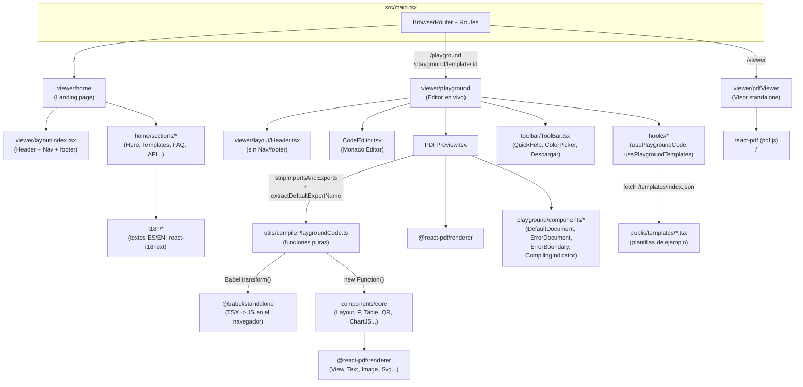

# Análisis Detallado — React PDF LevelUp (Frontend)

> Informe técnico generado a partir del contenido de `frontend.zip` (proyecto completo: `src/` + configuración de raíz). Describe la estructura completa del proyecto, la función de cada archivo/carpeta y cómo se conectan entre sí.
>
> **Re-auditoría completa (esta versión):** se descartó el informe anterior línea por línea y se revisó de nuevo todo el código fuente recibido, incluyendo por primera vez los archivos de configuración de la raíz (`package.json`, `vite.config.ts`, `tsconfig.json`, `tailwind.config.js`, `postcss.config.js`, `types.d.ts`, `index.html`), que en la auditoría previa no estaban disponibles. El proyecto tuvo una refactorización importante desde el último análisis, sobre todo en `viewer/playground` (nuevos hooks, pipeline de compilación separado en funciones puras, `QuickHelp` con i18n propio) y en `viewer/layout/Header.tsx` (reescrito). La mayoría de los bugs documentados anteriormente **ya están corregidos**; se listan como tal en la sección 17, junto con los que siguen abiertos y los hallazgos nuevos. La carpeta `public/` sigue sin estar incluida en el zip recibido, así que las plantillas estáticas (`public/templates/*.tsx`) no se pudieron reverificar.

---

## 1. Resumen ejecutivo

Este proyecto es el **frontend de "React PDF LevelUp"**, un sitio/herramienta que promociona y da soporte a una librería llamada **`@react-pdf-levelup/core`** (construida sobre `@react-pdf/renderer`) que permite generar documentos PDF usando componentes de React con sintaxis parecida a HTML (`<P>`, `<H1>`, `<Table>`, `<Row>`, `<Col6>`, etc.) en lugar de los primitivos de bajo nivel de react-pdf (`View`, `Text`, `StyleSheet`...).

El frontend cumple **tres funciones a la vez**:

1. **Landing page / marketing** (`/`) — explica qué es la librería, muestra ejemplos, plantillas, FAQ, roadmap, etc.
2. **Playground interactivo** (`/playground`, `/playground/template/:templateId`) — un editor de código en vivo (Monaco Editor) con vista previa de PDF en tiempo real, al estilo CodeSandbox/StackBlitz, especializado en `react-pdf`.
3. **Visor de PDF standalone** (`/viewer`) — un componente reutilizable para visualizar/navegar archivos PDF ya generados (subir archivo, zoom, rotar, paginar, descargar).

Adicionalmente, el propio código fuente de la librería (`src/components/core`) **vive dentro de este mismo repositorio** como una copia de trabajo/demo: es lo que alimenta tanto la vista previa del Playground como los ejemplos de la home. Esta copia local está pensada para uso **isomórfico** (navegador y Node/servidor): los componentes visuales corren en el navegador dentro del Playground, pero funciones como `generatePDF` (que usa `renderToStream` y `Buffer` de Node) están pensadas para consumirse desde un backend, tal como ocurre en otros proyectos del propio autor (p. ej. el sistema de optometría, que genera PDFs de carnets/credenciales en el servidor).

Es una SPA construida con **React 18/19 + Vite 6 + TypeScript 5.9 + TailwindCSS v4 + react-router-dom v7**, con soporte de internacionalización (i18next, ES/EN) y el compilador de React (`babel-plugin-react-compiler`) habilitado en build.

---

## 2. Stack tecnológico

| Categoría | Tecnología | Uso en el proyecto |
|---|---|---|
| Framework UI | React `>=18 <=19` | Toda la SPA |
| Bundler/dev server | Vite 6 | Build, dev server, proxy a `/api` y `/docs` |
| Compilador React | `babel-plugin-react-compiler` | Habilitado como plugin de Babel dentro de `@vitejs/plugin-react` (memoización automática) |
| Lenguaje | TypeScript ~5.9.3 | Todo el código fuente |
| Estilos | Tailwind CSS v4 (`@tailwindcss/postcss`) | Sistema de diseño de la UI web (no del PDF) |
| Ruteo | `react-router-dom` v7 | 4 rutas: `/`, `/playground`, `/playground/template/:templateId`, `/viewer` |
| Generación de PDF | `@react-pdf/renderer` ^4.3.2 (peerDependency) | Motor real de renderizado de PDF |
| Visor de PDF | `react-pdf` (pdf.js) | Componente `/viewer` |
| Editor de código | `@monaco-editor/react` + `monaco-editor` | Editor del Playground, en modo `typescript`/TSX |
| Transpilación en vivo | `@babel/standalone` | Compila TSX escrito por el usuario en el propio navegador |
| i18n de la landing | `i18next`, `react-i18next`, `i18next-browser-languagedetector` | Textos ES/EN de la home y del selector de idioma flotante |
| i18n del panel de ayuda | Sistema propio (`quickHelp/componentDocsText_es.ts` / `_en.ts`) | **Independiente** del i18next de la home (ver sección 9) |
| QR | `qrcode`, `qr-code-styling` | Componentes `<QR>` (canvas nativo del navegador) y `<QRstyle>` |
| Gráficos | `chart.js` | Componente `<ChartJS>`, renderizado en un `<canvas>` oculto del navegador |
| Componentes UI | Radix UI + patrón "shadcn/ui" | `src/components/ui/*` |
| Utilidades CSS | `clsx`, `tailwind-merge`, `class-variance-authority` | Función `cn()` y variantes de botones |
| Iconos | `lucide-react` (UI web) y `lucide` (paquete "crudo", para el componente `<Icon>` dentro del PDF) | |
| Dependencias server-side "huérfanas" en este repo | `canvas`, `jsdom`, `chartjs-node-canvas` | Declaradas en `package.json` pero **no se importan en ningún archivo de `src/`** (ver sección 15) — parecen pensadas para el uso server-side de la librería publicada, no para este frontend |

El `package.json` declara `@react-pdf/renderer` y `react`/`react-dom` como **peerDependencies**, y además depende de `@react-pdf-levelup/core`, `@react-pdf-levelup/qr` y `@react-pdf-levelup/chart` (paquetes publicados en npm). Esto confirma que este repo es el sitio de demostración/documentación de esa librería, aunque también mantiene una copia local del código fuente de los componentes (ver sección 7) que es la que realmente se usa en tiempo de ejecución dentro del Playground y la home — los paquetes de npm no se importan directamente en ningún componente de `src/`, solo se usan como referencia para generar los `import` de las plantillas descargadas (ver sección 11.3, `downloadTemplate.ts`).

---

## 3. Estructura de carpetas

```
frontend/
├── index.html                     # HTML raíz + SEO/OG/Twitter/JSON-LD + favicons
├── package.json                   # Scripts y dependencias
├── vite.config.ts                 # Alias "@", proxy /api (:4000) y /docs (:4500), react-compiler
├── tsconfig.json                  # Paths "@/*" y "@pdf/*" (este último sin carpeta real, ver sección 6)
├── tailwind.config.js             # Paleta de colores HSL/rgb + safelist de clases dinámicas
├── postcss.config.js              # Plugin @tailwindcss/postcss
├── types.d.ts                     # Tipado de @babel/standalone y de imports "*.pdf"
│
├── public/                        # No incluido en frontend.zip, sin reverificar en esta auditoría
│   └── (plantillas .tsx, index.json, assets, iconos — ver sección 12)
│
└── src/
    ├── main.tsx                   # Entry point: ReactDOM.createRoot + BrowserRouter + Routes
    ├── styles/index.css           # Tailwind + variables CSS del tema
    ├── lib/utils.ts                # Función cn() (clsx + tailwind-merge)
    │
    ├── functions/                  # Utilidades para trabajar con PDFs ya generados/base64
    │   ├── index.ts                # Reexporta solo decodeBase64Pdf y generatePDF
    │   ├── generatePDF.ts          # renderToStream + Buffer -> string base64 (uso server-side)
    │   ├── decodeBase64Pdf.ts      # base64 -> Blob -> descarga + abre en pestaña nueva (browser)
    │   └── printBase64Pdf.ts       # base64 -> iframe oculto -> print() — ⚠️ huérfano, ver sección 8
    │
    ├── i18n/                        # Internacionalización (ES/EN) de la landing page
    │   ├── index.ts                 # Inicializa i18next + LanguageDetector
    │   └── home/                    # api.ts, dev.ts, faq.ts, hero.ts, how.ts, nav.ts, roadmap.ts,
    │                                 # support.ts, templates.ts, use.ts, value.ts
    │
    ├── components/
    │   ├── core/                    # ⭐ LA LIBRERÍA react-pdf-levelup (código fuente local)
    │   │   ├── index.tsx             # Barrel: reexporta todo (componentes propios + primitivos de @react-pdf/renderer)
    │   │   ├── basic/
    │   │   │   ├── layout/
    │   │   │   │   ├── Layout.tsx            # Documento de una sola "plantilla" de página (con footer/paginación)
    │   │   │   │   ├── LayoutMultiPage.tsx   # Documento multi-página con <Section> y props heredables
    │   │   │   │   ├── NextPage.tsx          # <View break /> — salto de página manual
    │   │   │   │   └── helper/
    │   │   │   │       ├── getPageDimensions.ts  # +40 tamaños de papel ISO/ANSI en puntos (72dpi)
    │   │   │   │       ├── getMargins.ts         # Presets "apa"/"normal"/"estrecho"/"ancho" en mm->pt
    │   │   │   │       └── toPdfOrientation.ts   # Normaliza vertical/horizontal/v/h -> portrait/landscape
    │   │   │   ├── Etiquetas.tsx        # P, H1-H6, A, Strong, Em, U, Small, Blockquote, Mark, Span, BR, Div, HR
    │   │   │   ├── Grid.tsx             # Container, Row, Col1..Col12 (grid de 12 columnas con % fijo)
    │   │   │   ├── Tablet.tsx           # Table, Thead, Tbody, Tr, Th, Td (con soporte real de colSpan)
    │   │   │   ├── Form.tsx             # Form, Input, TextArea, Checkbox (placeholders visuales, no interactivos)
    │   │   │   ├── Position.tsx         # Left, Right, Center (alineación + centrado vertical opcional)
    │   │   │   ├── Img.tsx / ImgBg.tsx  # Imagen simple / imagen de fondo posicionada absoluta
    │   │   │   └── Lista.tsx            # UL, OL, LI
    │   │   ├── qr/
    │   │   │   ├── QR.tsx               # QR "plano" vía canvas del navegador, con fallback a api.qrserver.com
    │   │   │   ├── QRGenerator.ts       # Lógica de generación + composición de logo central
    │   │   │   ├── QRstyle.tsx          # QR con estilos avanzados (qr-code-styling)
    │   │   │   └── QRstyleGenerator.ts
    │   │   ├── charts/
    │   │   │   ├── ChartJS.tsx          # Renderiza Chart.js a PNG (canvas oculto) e inyecta como <Image>
    │   │   │   └── ChartJSGenerator.ts  # generateChartAsBase64() con caché en memoria
    │   │   └── icono/Icon.tsx           # Convierte iconos "crudos" de la librería `lucide` a <Svg>/<Path> de react-pdf
    │   │
    │   ├── ui/                          # accordion, badge, button, card, input, popover, scroll-area, select, tabs, tooltip
    │   │
    │   └── viewer/
    │       ├── layout/
    │       │   ├── Header.tsx           # Header fijo, reescrito por completo (ver sección 11.1)
    │       │   ├── Navegacion.tsx       # Barra flotante con selector ES/EN + botón "volver arriba" (solo en home)
    │       │   ├── TemplateSelector.tsx # <Select> que abre una plantilla en pestaña nueva (solo en Header del playground)
    │       │   └── index.tsx            # Layout wrapper: Header + children + (Nav + footer si no es "playground")
    │       │
    │       ├── home/
    │       │   ├── index.tsx            # Orquesta las secciones dentro de <Layout context="home">
    │       │   └── sections/            # 14 archivos; varios están escritos pero comentados (ver sección 11.2)
    │       │
    │       ├── playground/              # El editor en vivo — ver árbol detallado en 3.1
    │       │
    │       └── pdfViewer/
    │           └── index.tsx            # Visor standalone basado en react-pdf (pdf.js): zoom, rotar, paginar, subir, descargar
```

### 3.1 Estructura de `src/components/viewer/playground/`

Esta carpeta es la que más cambió desde la última auditoría. Ya no es un puñado de archivos con la lógica mezclada: ahora está dividida en `components/` (presentación), `hooks/` (estado y efectos reutilizables), `toolbar/` (barra de herramientas + `quickHelp/` con datos de documentación) y `utils/` (funciones puras de compilación/carga):

```
playground/
├── index.tsx                        # Orquestador: usa 2 hooks (templates + code) y ensambla Header/Editor/Toolbar/Preview
├── CodeEditor.tsx                    # Wrapper de Monaco: modo TSX, autocompletado, auto-eliminación de imports
├── PDFPreview.tsx                    # Orquesta la compilación con funciones puras de utils/compilePlaygroundCode.ts
│
├── components/                       # Componentes de presentación puros (sin lógica de negocio)
│   ├── DefaultDocument.tsx           # PDF de bienvenida ("Esperando código...") en el estado inicial
│   ├── ErrorDocument.tsx             # PDF de error con mensaje formateado
│   ├── ErrorBoundary.tsx             # Class component: atrapa errores de render de React (no de Babel/eval)
│   ├── CompilingIndicator.tsx        # Badge flotante "Compilando..." durante el debounce
│   └── MobileWarning.tsx             # Pantalla de aviso "no disponible en móvil" con opción de continuar igual
│
├── hooks/
│   ├── usePlaygroundTemplates.ts     # Carga /templates/index.json una sola vez
│   ├── usePlaygroundCode.ts          # Resuelve el código inicial (plantilla por URL -> localStorage -> "default") y persiste
│   ├── useMobileDetection.ts         # User-agent + matchMedia(max-width: 768px)
│   ├── useClickOutside.ts            # Cierra popovers (QuickHelp, ColorPicker) al hacer click afuera
│   └── useClipboard.ts               # copy() con fallback a document.execCommand + estado "copiado" con timeout
│
├── toolbar/
│   ├── ToolBar.tsx                   # Contenedor flotante: QuickHelp + ColorPicker + botón Descargar
│   ├── QuickHelp.tsx                 # Panel de documentación, ahora ~solo UI (216 líneas; antes ~729 con los datos incluidos)
│   ├── ColorPicker.tsx               # Selector de color con paleta, input nativo y "colores recientes" en memoria
│   ├── func/
│   │   └── downloadTemplate.ts       # Genera el .tsx descargable con imports correctos (antes "funciones/dowloadTemplate.ts")
│   └── quickHelp/                     # 🆕 Datos de documentación separados de la UI, con soporte ES/EN
│       ├── types.ts                   # TabId, BaseComponentDoc/PropDoc, ComponentDoc/PropDoc, ComponentDocsText
│       ├── componentDocsBase.ts       # Estructura de props por componente (8 tabs: layout, text, table, position, lists, media, page, fonts)
│       ├── componentDocsText_es.ts    # Descripciones/ejemplos en español
│       ├── componentDocsText_en.ts    # Descripciones/ejemplos en inglés
│       └── buildComponentDocs.ts      # Combina base + textos localizados según el idioma activo
│
└── utils/
    ├── compilePlaygroundCode.ts       # 🆕 Pipeline de compilación dividido en funciones puras (ver sección 13)
    ├── monacoSnippets.ts              # 🆕 getMonacoSnippets(): catálogo de snippets de autocompletado (extraído de CodeEditor.tsx)
    └── templateLoader.ts              # loadTemplateFile(): fetch resuelto contra import.meta.env.BASE_URL
```

---

## 4. Arquitectura general (cómo se conecta todo)



**Idea central:** el `Playground` toma el texto que el usuario escribe en el editor Monaco, lo pasa por un pipeline de funciones puras (`compilePlaygroundCode.ts`) que limpia imports, detecta el `export default`, transpila con Babel *en el propio navegador* y ejecuta el resultado con `new Function(...)`, inyectándole como "variables globales" tanto los primitivos de `@react-pdf/renderer` como **todos** los componentes de `components/core`. El resultado se renderiza dentro de un `<PDFViewer>` (el visor embebido de `@react-pdf/renderer`). Así el usuario ve el PDF actualizarse mientras escribe, sin necesidad de un backend.

---

## 5. Punto de entrada y enrutamiento

### `index.html`
HTML raíz con metadatos SEO completos (`description`, `keywords`, `canonical`), Open Graph, Twitter Card, favicons, `theme-color`, hints de `dns-prefetch`/`preload`/`prefetch` (algunos comentados) y JSON-LD `SoftwareApplication` con autor "Genaro Gonzalez". No incluye el script de Google Analytics de forma directa en el fragmento inspeccionado, aunque el informe original lo mencionaba; no se pudo confirmar su presencia más abajo en el archivo.

### `src/main.tsx`
```tsx
<StrictMode>
  <BrowserRouter>
    <Routes>
      <Route path="/" element={<Home />} />
      <Route path="/playground" element={<Playground />} />
      <Route path="/playground/template/:templateId" element={<Playground />} />
      <Route path="/viewer" element={<PdfViewer />} />
    </Routes>
  </BrowserRouter>
</StrictMode>
```
Sin cambios respecto al informe anterior.

---

## 6. Configuración del proyecto (verificada por primera vez en esta auditoría)

### `vite.config.ts`
- Plugin `@vitejs/plugin-react` con `babel-plugin-react-compiler` habilitado (el React Compiler corre en cada build/dev).
- Alias `"@"` → `./src`.
- `optimizeDeps.include: ["@monaco-editor/react"]` (evita el re-bundle en caliente del editor durante el desarrollo).
- Proxy de desarrollo: `/api` → `http://localhost:4000` y `/docs` → `http://localhost:4500` (ambos con `ws: true`), lo que confirma que este frontend está pensado para correr junto a un backend propio (`/api`) y un sitio de documentación aparte (`/docs`) — el enlace "documentacion" del `Header` en el Playground apunta justamente a `/docs/es/get-started`.
- `server`/`preview` con `allowedHosts: true` y `hmr.overlay: false`.

### `tsconfig.json`
- `paths`: `"@/*" -> "src/*"` y **`"@pdf/*" -> "src/pdf/*"`**. La carpeta `src/pdf/` **no existe** en este proyecto — el alias está declarado pero huérfano (confirmado en esta auditoría, no solo sospechado).
- `include` contiene **`"../api/src/useExample"`**, una ruta fuera de este repositorio que solo tiene sentido dentro de un monorepo más grande (coherente con el resto de proyectos del autor, que usan pnpm workspaces).
- `strict: true`, `noUnusedParameters: true` pero `noUnusedLocals: false` (permite variables locales sin usar, no parámetros).
- Target `ES2023`, `moduleResolution: "bundler"`.

### `package.json` (scripts)
```json
"dev": "vite --host 0.0.0.0 --port 3000",
"build": "tsc -b && vite build",
"lint": "eslint .",
"start": "vite preview --host 0.0.0.0 --port 8888",
"demo": "tsx ./src/useExample/index.ts"
```
- El script `demo` apunta a `./src/useExample/index.ts`, que **no existe en ningún lugar del proyecto** (ni en `src/`, ni en la ruta `../api/src/useExample` que sí declara `tsconfig.json`) — confirmado en esta auditoría que sigue roto.
- **No hay archivo de configuración de ESLint** (`eslint.config.js`/`.eslintrc*`) en la raíz del proyecto entregado, pese a que `eslint`, `typescript-eslint`, `eslint-plugin-react-hooks` y `eslint-plugin-react-refresh` están en `devDependencies` y el script `lint` existe — confirmado, sigue faltando.

### `tailwind.config.js` / `postcss.config.js`
- Paleta de colores fija en `rgb(... / <alpha-value>)` con nombres semánticos (`background`, `foreground`, `muted`, `primary`, `accent`, `destructive`...), más una escala `gray` explícita.
- `safelist` extensa (~70 clases) de utilidades de layout, texto, color, borde, espaciado y efectos — típico cuando alguna de esas clases se arma dinámicamente en JS/template strings y Tailwind no puede detectarla estáticamente en el análisis de contenido.
- `content` incluye `./public/**/*.{js,ts,jsx,tsx}`, lo que tiene sentido porque las plantillas descargables en `public/templates/*.tsx` también usan clases Tailwind indirectamente vía JSX (aunque en el PDF no se procesan como CSS real, solo como código de ejemplo).

### `types.d.ts`
Declara el módulo `@babel/standalone` (con la firma de `transform()`) y el wildcard `*.pdf` (para poder importar archivos `.pdf` como string). Sin cambios funcionales relevantes.

---

## 7. El core: la librería de componentes `react-pdf-levelup`

`src/components/core/index.tsx` es un barrel que reexporta:

- **Layout**: `Layout`, `LayoutMultiPage` + `Section`, `NextPage`.
- **Texto**: `P, A, H1-H6, HR, Strong, Em, U, Small, Blockquote, Mark, Span, BR, Div`.
- **Tabla**: `Table, Thead, Tbody, Tr, Th, Td`.
- **Formulario**: `Form, Input, TextArea, Checkbox`.
- **Grid**: `Container, Row, Col1...Col12`.
- **Listas**: `UL, OL, LI`.
- **Posición**: `Left, Right, Center`.
- **Imagen**: `Img, ImgBg`.
- **QR**: `QR, QRstyle`.
- **Gráficos**: `ChartJS`.
- **Iconos**: `Icon`.
- **Funciones**: `decodeBase64Pdf, generatePDF` (reexportadas desde `functions/`).
- **Herencia directa de `@react-pdf/renderer`**: `PDFViewer, Document, Page, Text, View, StyleSheet, Font, Image, Link, Svg, Defs, Rect, LinearGradient, Stop, G, renderToStream, Canvas, Polygon, ClipPath`.

Detalles verificados componente por componente en esta auditoría:

- **`Layout.tsx`** (296 líneas): documento de una página con soporte de `size` (más de 40 tamaños ISO/ANSI vía `helper/getPageDimensions.ts`: A0-A8, B0-B9, C0-C8, RA/SRA0-4, `EXECUTIVE`, `FOLIO`, `LEGAL`, `LETTER`, `TABLOID`, `ID1`), `orientation`, `margin` (presets `apa`/`normal`/`estrecho`/`ancho` en mm reales convertidos a puntos), `footer` + `footerLines` (reserva de espacio proporcional al número de líneas), `pagination` (numeración automática `pageNumber / totalPages`), `rule` (cuadrícula de depuración en centímetros) y `meta` (metadatos del PDF: título, autor, etc.). Sanitiza props inválidas con `console.warn` + fallback en vez de lanzar error.
- **`LayoutMultiPage.tsx`** (339 líneas) + **`Section`**: variante para documentos de varias páginas con configuración distinta por página. Cada `<Section>` (hijo directo de `<LayoutMultiPage>`) recibe automáticamente, vía `React.cloneElement`, las props globales (tamaño, orientación, margen, footer, etc.) como props internas `__global*`, y puede sobreescribir cualquiera de ellas individualmente (patrón "local > global" con una función `resolve()`).
- **`NextPage.tsx`**: un simple `<View break />` para forzar salto de página manual dentro de un `Layout`.
- **`Tablet.tsx`** (309 líneas): implementa `colSpan` correctamente — la fila (`Tr`) calcula el total de "unidades" de columna sumando el `colSpan` de cada celda (no solo la cantidad de celdas), y reparte el ancho porcentual sobre ese total. También soporta dos modos visuales (`grid` con bordes completos, `modern` con solo línea inferior) y filas cebra (`zebraColor`).
- **`Form.tsx`**: `Input`, `TextArea` y `Checkbox` son representaciones **visuales** (no interactivas: es un PDF) con placeholder, label opcional y asterisco de "requerido". El nombre exportado es `TextArea` (con "A" mayúscula intermedia).
- **`Grid.tsx`**: grid clásico de 12 columnas con anchos porcentuales fijos (`col1` = 8.33% ... `col12` = 100%), sin utilidades de `offset` ni breakpoints (no tendría sentido en un documento PDF de tamaño fijo).
- **`Position.tsx`**: `Left`/`Right`/`Center` alinean contenido horizontalmente y, con la prop `vertical`, también centran verticalmente (`justifyContent: center`).
- **`QR.tsx`** (116 líneas): genera el QR con `qrcode` en un canvas del navegador (`QRGenerator.ts`), compone un logo central si se indica, y **solo** si la generación local falla recurre a un fallback externo (`api.qrserver.com`) — a diferencia de antes, este fallback ya no se usa como placeholder temporal mientras se genera el QR real, lo que evita una llamada de red innecesaria y un problema de privacidad (enviar la URL codificada a un servicio de terceros en cada render).
- **`QRstyle.tsx`**: QR con estilos avanzados (colores por zona, esquinas, puntos) vía `qr-code-styling`.
- **`ChartJS.tsx`** (116 líneas de `ChartJSGenerator.ts`): renderiza un gráfico de Chart.js en un `<canvas>` oculto creado con `document.createElement("canvas")` (**no** usa el paquete `canvas` de Node ni `chartjs-node-canvas`, pese a que ambos están en `package.json`), lo convierte a PNG con `toDataURL()` y lo inyecta como `<Image>` de `@react-pdf/renderer`. Tiene una caché en memoria (`Map`) por configuración+tamaño para no re-renderizar gráficos idénticos.
- **`Icon.tsx`** (172 líneas): traduce el formato de datos "crudo" del paquete `lucide` (arrays de `[tag, attrs]`) a primitivas SVG de `@react-pdf/renderer` (`Svg`, `Path`, `G`, `Circle`, `Rect`, `Line`, `Ellipse`, `Polygon`, `Polyline`), ya que los íconos de `lucide-react` (componentes React normales) no son compatibles con el renderer de PDF.

---

## 8. Funciones utilitarias (`src/functions/`)

- **`generatePDF.ts`**: usa `renderToStream` de `@react-pdf/renderer` y `Buffer`/eventos de stream de Node para producir un string en base64. Está pensada para un entorno **servidor** (Node/Fastify), no para el navegador — coincide con el patrón que el propio autor usa en otros proyectos (generación de PDFs de credenciales en el backend).
- **`decodeBase64Pdf.ts`**: la contraparte en **navegador**: decodifica un base64, crea un `Blob`, dispara una descarga (`<a download>`) y abre el PDF en una pestaña nueva; revoca el `ObjectURL` a los 30s.
- **`printBase64Pdf.ts`**: decodifica un base64 e imprime el PDF mediante un `<iframe>` oculto y `contentWindow.print()`. **Sigue sin usarse ni reexportarse** desde `functions/index.ts` ni desde `core/index.tsx` — confirmado en esta auditoría (`grep` sobre todo `src/` no encuentra ninguna referencia fuera de su propio archivo).

`functions/index.ts` solo reexporta `decodeBase64Pdf` y `generatePDF`.

---

## 9. Internacionalización

Hay **dos sistemas de i18n independientes y sin relación entre sí**, algo que vale la pena tener presente porque no es evidente a primera vista:

1. **`src/i18n/`** (i18next + react-i18next + language-detector): traduce la landing page (`home/sections/*`) y el selector de idioma flotante de `Navegacion.tsx`. Combina 11 archivos de recursos (`hero`, `value`, `templates`, `how`, `dev`, `use`, `api`, `roadmap`, `support`, `faq`, `nav`) en un único `resources.{es,en}.translation`, con `fallbackLng: "en"`.
2. **`toolbar/quickHelp/`** (sistema propio, sin librería): el panel de ayuda del Playground (`QuickHelp.tsx`) mantiene su propio estado de idioma local (`useState<"es" | "en">`) y arma la documentación combinando `componentDocsBase.ts` (estructura y props, sin traducir) con `componentDocsText_es.ts` / `_en.ts` (descripciones y ejemplos) a través de `buildComponentDocs(lang)`. Cambiar el idioma en el `Header` de la home **no afecta** el idioma del panel `QuickHelp` del Playground, y viceversa — son dos estados desconectados.

---

## 10. Componentes UI genéricos (`src/components/ui/`)

Conjunto estándar de componentes estilo shadcn/ui sobre Radix UI: `accordion`, `badge`, `button`, `card`, `input`, `popover`, `scroll-area`, `select`, `tabs`, `tooltip`. Sin cambios relevantes respecto al informe anterior.

---

## 11. Capa "viewer" — las páginas de la aplicación

### 11.1 `viewer/layout/` — reescrito por completo

- **`Header.tsx`**: se reescribió desde cero respecto a la versión auditada anteriormente. Cambios relevantes:
  - Ya **no** recibe ni usa una prop `code` (el bug de la prop muerta del informe anterior desapareció junto con el resto del componente viejo).
  - El valor de `context` ahora es literalmente `"playground"` en todos los usos — el typo histórico `"playgroud"` ya no existe en ningún lugar del código revisado.
  - Incluye navegación completa por anclas (`#features`, `#templates`, `#como-funciona`, etc.) traducida vía `react-i18next`, menú móvil animado, y — solo en `context="playground"` — un enlace a `/docs/es/get-started`, el `TemplateSelector` (cargado con `React.lazy`/`Suspense`) y un enlace a GitHub.
  - Es un componente bastante más grande y con más estados (`mobileOpen`) que la versión anterior.
- **`Navegacion.tsx`** (`Nav`): barra flotante inferior/derecha, visible solo en `context="home"` (se renderiza condicionalmente desde `viewer/layout/index.tsx`), con selector ES/EN (via `i18n.changeLanguage`) y botón "volver arriba" que aparece al hacer scroll.
- **`TemplateSelector.tsx`**: `<Select>` (shadcn) que carga `/templates/index.json` y, al elegir una plantilla, abre `/playground/template/:id` en una **pestaña nueva** (`window.open(..., "_blank")`) en lugar de navegar en la misma pestaña.
- **`index.tsx`** (`Layout` wrapper): envuelve `Header` + `children` y, **solo si `context !== "playground"`**, agrega `Nav` y un `<footer>` con el aviso de licencia MIT. Lo usa `viewer/home/index.tsx`; el Playground en cambio importa `Header` directamente (no pasa por este wrapper), ya que no necesita `Nav` ni el footer.

### 11.2 `viewer/home/`

`home/index.tsx` envuelve las secciones en `<Layout context="home">`. De las 14 secciones que existen como archivo en `home/sections/`, **4 están comentadas y no se renderizan**: `ComparisonSection`, `CtaSection`, `TechStackSection` y `WhyLevelupSection` (marcadas explícitamente en el código como "secciones irrelevantes"). Además, `SupportAndDonationsSection` está importada pero también comentada en el JSX, así que tampoco se muestra actualmente pese a estar completamente implementada. Las que sí se renderizan, en este orden: `HeroSection`, `ValueProposition`, `DeveloperFeatures`, `TemplatesSection`, `HowItWorks`, `ApiSection`, `RoadmapSection`, `UseCasesSection`, `FaqSection`.

### 11.3 `viewer/playground/` — el editor en vivo

Ver el árbol de la sección 3.1. Flujo general:

- **`index.tsx`** (`Editor`): usa `usePlaygroundTemplates()` para cargar el índice de plantillas y `usePlaygroundCode(templateId, templates, templatesLoaded)` para resolver el código inicial. La lógica de precedencia (plantilla por URL → `localStorage` → plantilla `"default"`) y la de guardado (solo cuando no hay `:templateId` en la URL, para no pisar el progreso del usuario al visitar una plantilla) ahora vive encapsulada en el hook, con comentarios explícitos sobre por qué se persiste solo en ese caso.
- **`CodeEditor.tsx`**: el editor Monaco está configurado como modelo `typescript` con `path="playground-code.tsx"` (antes se trataba como JavaScript plano, lo que generaba errores de tipo 8010 al usar anotaciones TS). Se apaga la validación **semántica** de TypeScript (`noSemanticValidation: true`) porque los componentes del `core` se inyectan como "globales" en tiempo de ejecución y el language service no puede saber que existen — pero se deja activa la validación **sintáctica**, así que errores reales (JSX sin cerrar, llaves faltantes) se siguen marcando. El debounce del `onChange` (1000ms) está memoizado una única vez con `useMemo` para no crear una instancia nueva en cada render, y los `completionItemProvider` registrados en Monaco se disponen correctamente al desmontar. También incorpora un listener que **borra automáticamente** cualquier declaración `import` que el usuario escriba o pegue (no tendrían efecto en el scope aislado del `new Function`). Los snippets de autocompletado se extrajeron a `utils/monacoSnippets.ts` (`getMonacoSnippets`).
- **`PDFPreview.tsx`**: orquesta la compilación llamando a las funciones puras de `utils/compilePlaygroundCode.ts` (ver sección 13) y delega los distintos estados visuales en tres componentes de presentación (`DefaultDocument`, `ErrorDocument`, `CompilingIndicator`) más un `ErrorBoundary` (clase) que envuelve al `<PDFViewer>` para atrapar errores que ocurren **durante el render de React** (a diferencia de los errores de sintaxis/ejecución, que ya se atrapan antes con el resultado tipado `{ ok, error }` de cada función del pipeline). El contenedor raíz ahora sí declara `position: "relative"`, así que el badge `CompilingIndicator` (`position: absolute`) queda correctamente anclado al panel de vista previa.
- **`toolbar/*`**: `ToolBar` agrupa `QuickHelp`, `ColorPicker` y el botón de descarga (`downloadTemplate`) en una barra flotante `fixed bottom-6 left-1/2 -translate-x-1/2`. `QuickHelp` es ahora casi puramente de presentación (216 líneas) y delega los datos en `toolbar/quickHelp/*` con soporte ES/EN. `ColorPicker` mantiene los "colores recientes" en una variable de módulo compartida (`sharedRecentColors`) en vez de `localStorage`, **a propósito**: el propio código documenta que es una decisión de diseño (sobrevive a que el componente se desmonte/remonte en la misma sesión, pero se resetea al recargar la página), no un descuido.

### 11.4 `viewer/pdfViewer/`

Visor standalone (`react-pdf`/pdf.js): permite pasar un `url` o un `File`, o subir uno desde un botón; soporta navegación de páginas, zoom (0.5x–3x), rotación en pasos de 90°, y descarga del archivo cargado. Maneja estados de carga y error tanto a nivel de documento como de página, con mensajes en español. Sin cambios relevantes respecto al informe anterior.

---

## 12. Recursos estáticos (`public/`)

**No incluidos en el `frontend.zip` recibido en esta auditoría** — igual que en la anterior, esta sección no se pudo reverificar y se documenta solo a título informativo, en base a referencias indirectas encontradas en el código (`vite.config.ts`, `tailwind.config.js`, `index.html`, `TemplateSelector.tsx`, `templateLoader.ts`):

- `public/templates/index.json` — índice de plantillas que consume `usePlaygroundTemplates`.
- `public/templates/*.tsx` — archivos de plantilla individuales, cargados como texto plano vía `loadTemplateFile()`.
- `public/asset/`, `public/iconos/`, `public/imgTemplates/` — imágenes/íconos referenciados desde `index.html` y (probablemente) desde las plantillas.
- `public/robots.txt`.

Si se quiere una verificación completa de esta carpeta (por ejemplo, confirmar si `Etiquetas.tsx` sigue vacío en `public/templates/`, o si el alias `@pdf/*` tenía relación con algo ahí), habría que compartir un zip que la incluya.

---

## 13. Flujo completo: de código escrito a PDF visible (paso a paso)

1. El usuario escribe/pega TSX en `CodeEditor` (Monaco). El `onChange` está debounced a 1000ms.
2. `PDFPreview` recibe el nuevo `code` y, tras otro debounce interno de 300ms (más un caso especial para el primer render), llama a `compileCode(sourceCode)`.
3. Dentro de `compileCode`, el pipeline de `utils/compilePlaygroundCode.ts` corre en este orden:
   1. **`stripImportsAndExports`** — elimina `import`s y `export { ... }`/`export const|function|class` "planos" del código.
   2. **`extractDefaultExportName`** — busca el `export default` en el código **original** (antes de limpiar) y determina su forma (`function`, `class`, `arrow`/`const`, o identificador suelto). Si no encuentra ninguno, corta el proceso de inmediato con un mensaje de error explícito ("No se encontró ningún componente exportado por defecto...") — a diferencia de la versión anterior, **ya no existe un fallback** que adivine el componente por convención de nombres (`const NombreConMayúscula = ...`).
   3. **`stripDefaultExport`** — reescribe el `export default` detectado en una declaración normal + `const result = Nombre;`.
   4. **`transpileToJs`** — corre `Babel.transform` con los presets `typescript` (`isTSX: true`) y `react`. Devuelve `{ ok: false, error }` en vez de lanzar si hay un error de sintaxis.
   5. **`getUsableComponentNames`** — calcula qué claves de `CoreComponents` (namespace de `components/core`) son "inyectables": funciones, objetos (para los componentes envueltos en `React.memo`, como `Img`/`Icon`/`QR`) **y strings** — este último caso es necesario porque `@react-pdf/renderer` no implementa `Text`, `View`, `Document`, `Page`, `Image`, etc. como componentes React reales, sino como *strings* literales (`"TEXT"`, `"VIEW"`...) que su reconciler interpreta como tipos de elemento "host". Sin incluir los strings en el filtro, el JSX `<Text>`/`<Document>` resolvería contra el `window.Text`/`window.Document` nativo del navegador y fallaría con errores como *"Please use the 'new' operator"*.
   6. **`buildAndRunComponent`** — arma un string de módulo (`'use strict'` + destructuring de `CoreComponents` + el código transpilado + `return result`) y lo ejecuta con `new Function(...)`, inyectando `React` y `CoreComponents` como argumentos. Valida que el resultado sea una función antes de aceptarlo como componente.
4. Si cualquier paso falla, `PDFPreview` muestra `ErrorDocument` con el mensaje correspondiente. Si todo sale bien, actualiza el estado `Component` y React vuelve a renderizar el `<PDFViewer>` con el nuevo componente — cualquier error que ocurra *en ese render* (no en la compilación) lo atrapa el `ErrorBoundary` de clase.
5. El usuario puede copiar ejemplos desde `QuickHelp`, elegir colores desde `ColorPicker`, o descargar el código actual como archivo `.tsx` autosuficiente vía `downloadTemplate()` (que analiza qué componentes del `core` realmente se usan en el código y arma los `import` correspondientes contra `@react-pdf-levelup/core`, `@react-pdf-levelup/qr` o `@react-pdf-levelup/chart`, según corresponda).

---

## 14. Relación con los paquetes npm `@react-pdf-levelup/*`

Sin cambios de fondo respecto al informe anterior: el código que realmente se ejecuta en este repositorio (tanto en el Playground como en la home) es la copia local de `src/components/core`, **no** los paquetes publicados en npm. Los paquetes (`@react-pdf-levelup/core`, `@react-pdf-levelup/qr`, `@react-pdf-levelup/chart`) solo se referencian como strings en `downloadTemplate.ts` para armar los `import` del archivo que el usuario descarga, y como dependencias declaradas en `package.json` (posiblemente para pruebas de integración o para el propio autor, ya que no se importan en ningún componente de `src/`).

La generación de los `import` en `downloadTemplate.ts` ahora es consistente con el casing real de los componentes (`QRstyle`, no `QRStyle` — ver sección 17), así que el archivo descargado ya no rompe al reimportarlo en un proyecto externo que solo tenga instalado `@react-pdf-levelup/qr` o `@react-pdf-levelup/chart`.

---

## 15. Observaciones e inconsistencias vigentes

Esta lista reemplaza a la sección 15 del informe anterior, actualizada tras revisar el código actual:

1. **`printBase64Pdf.ts` sigue sin conectarse a nada** (ver sección 8) — confirmado.
2. **Alias `@pdf/*` en `tsconfig.json` sin carpeta correspondiente** (`src/pdf/` no existe) — confirmado en esta auditoría, ya con el `tsconfig.json` real a la vista.
3. **`tsconfig.json` referencia un monorepo externo** (`"../api/src/useExample"` en `include`) que no forma parte de este repositorio — confirmado.
4. **Script `demo` roto**: apunta a `./src/useExample/index.ts`, que no existe en ningún lugar accesible desde este proyecto — confirmado.
5. **Sin configuración de ESLint en la raíz**, pese a tener las dependencias y el script `lint` — confirmado con el `package.json` completo a la vista.
6. **Cuatro secciones de marketing completas pero no renderizadas** en la home (`ComparisonSection`, `CtaSection`, `TechStackSection`, `WhyLevelupSection`), y una quinta (`SupportAndDonationsSection`) importada pero comentada en el JSX — actualizado respecto al informe anterior, que solo mencionaba esto de forma genérica ("en pausa").
7. **Dependencias `canvas`, `jsdom` y `chartjs-node-canvas` declaradas pero no usadas** en ningún archivo de `src/` — hallazgo nuevo de esta auditoría; probablemente necesarias solo para el uso server-side de la librería publicada (fuera de este frontend).
8. **Dos sistemas de i18n desconectados** (i18next para la home, sistema propio para `QuickHelp`) — ver sección 9; no es un bug, pero es una fuente probable de confusión si en el futuro se quiere unificar el idioma de toda la app con un solo selector.
9. **Persistencia de "colores recientes" en memoria, no en `localStorage`**, en `ColorPicker.tsx` — sigue así, pero ahora está documentado en el propio código como decisión intencional, no como descuido (matiz respecto al informe anterior, que lo listaba como inconsistencia).
10. **`public/templates/Etiquetas.tsx` vacío** y demás detalles de `public/` — sin poder reverificar, ver sección 12.

---

## 16. Cómo ejecutar el proyecto

```bash
pnpm install          # o npm/yarn — el repo no fuerza un gestor específico
pnpm dev              # vite --host 0.0.0.0 --port 3000
pnpm build            # tsc -b && vite build
pnpm start            # vite preview --host 0.0.0.0 --port 8888 (sirve el build)
pnpm lint             # eslint . (sin configuración incluida, ver sección 15)
```

El dev server proxea `/api` a `http://localhost:4000` y `/docs` a `http://localhost:4500`; si esos servicios no están corriendo localmente, cualquier llamada a esas rutas fallará (no debería afectar al Playground ni a la home, que no dependen de `/api` para nada visible en este código).

---

## 17. 🐞 Estado de los bugs encontrados en la auditoría anterior + hallazgos nuevos

### Bugs previamente reportados que ya están corregidos

| # | Bug original | Estado | Evidencia en el código actual |
|---|---|---|---|
| 1 | `QRStyle` (mayúscula incorrecta) en `QuickHelp.tsx` y `dowloadTemplate.ts`, rompía el ejemplo copiable y la descarga | ✅ **Corregido** | `componentDocsText_es/en.ts` y `downloadTemplate.ts` usan `QRstyle` en todos lados |
| 2 | Snippet de autocompletado `Textarea` (minúscula) no coincidía con el componente real `TextArea` | ✅ **Corregido** | `monacoSnippets.ts`: `etiquetaAutoConclusiva("TextArea", ...)` |
| 3 | `QuickHelp.tsx` documentaba un componente `Header` que no existe en `components/core` | ✅ **Corregido** | La pestaña "page" de `componentDocsBase.ts` ya no incluye `Header` |
| 4 | Prop `lines` documentada en vez de `footerLines` en el ejemplo de pie de página | ✅ **Corregido** | `componentDocsBase.ts` usa `footerLines` en ambas pestañas (layout y page) |
| 5 | `CompilingIndicator` mal posicionado por falta de `position: relative` en el contenedor | ✅ **Corregido** | `PDFPreview.tsx`: `<div style={{ position: "relative", ... }}>` |
| 6 | Prop `code` pasada a `Header` pero nunca usada (código muerto) | ✅ **Corregido** | `Header.tsx` fue reescrito; ya no declara ni recibe `code` |
| 7 | Typo `"playgroud"` como valor de `context` | ✅ **Corregido** | Todos los usos revisados dicen `"playground"` |
| 8 | Fallback de detección de componente (`const NombreConMayúscula = ...`) podía elegir un subcomponente equivocado si faltaba `export default` | ✅ **Resuelto (con cambio de comportamiento)** | `extractDefaultExportName` ya no tiene fallback: si no hay `export default` explícito, se muestra un error claro en vez de arriesgarse a adivinar mal |

### Bug previamente reportado que sigue abierto

- **`ToolBar` se centra respecto a todo el viewport, no respecto al panel del editor** (antes bug #6 del informe anterior). `toolbar/ToolBar.tsx` sigue usando `className="fixed bottom-6 left-1/2 -translate-x-1/2 z-50"`, calculado contra toda la ventana del navegador, mientras que el `ToolBar` se renderiza dentro del panel izquierdo (mitad de la pantalla) en `playground/index.tsx`. Sigue pudiendo aparecer centrado sobre el límite editor/preview en vez de bajo el editor. **Fix sugerido, sin cambios respecto a antes:** usar `absolute` dentro de un contenedor `relative` que sea el panel del editor, o ajustar `left` manualmente (p. ej. `left-1/4`).

### Cambio de comportamiento a tener en cuenta (no es un bug, pero es una ruptura de compatibilidad)

Con la eliminación del fallback de detección de componentes (ex-bug #8), **cualquier plantilla o snippet que no tenga un `export default` explícito ahora falla con un error claro** en vez de intentar adivinar qué componente mostrar. Esto es más seguro y predecible, pero si existen plantillas antiguas en `public/templates/` que dependían del comportamiento anterior (definir varios sub-componentes y confiar en que se detectara el correcto por convención de nombres), dejarían de funcionar hasta que se les agregue `export default` explícitamente. No se pudo verificar contra `public/templates/*.tsx` porque esa carpeta no está incluida en el zip analizado (ver sección 12).

### Hallazgos nuevos de esta auditoría (no relacionados con bugs anteriores)

- **Refuerzo de privacidad/fiabilidad en `QR.tsx`**: el fallback a `api.qrserver.com` ahora solo se dispara si la generación local realmente falla, en vez de usarse como placeholder por defecto — reduce llamadas de red innecesarias a un servicio externo con la URL codificada del usuario.
- **Soporte ampliado de tamaños de página**: `getPageDimensions.ts` pasó de manejar unos pocos tamaños a una tabla completa de formatos ISO 216 (A/B/C), RA/SRA, y formatos norteamericanos (`LETTER`, `LEGAL`, `TABLOID`, `EXECUTIVE`, `FOLIO`), además de `ID1` (tamaño de tarjeta/carnet) — coherente con el caso de uso de generación de carnets del propio autor en otro proyecto.
- **`colSpan` en tablas ahora funciona correctamente**: `Tr` calcula el total real de "unidades" de columna (sumando `colSpan`, no solo contando celdas), eliminando el problema de overflow (>100% de ancho) en filas con celdas fusionadas.
- **`QuickHelp` migró de un archivo monolítico (~729 líneas) a una arquitectura de datos separada de la presentación**, con soporte bilingüe real (selector ES/EN dentro del propio panel) — un cambio estructural grande que no rompe nada, pero que un desarrollador que edite la documentación del Playground debe conocer: ya no se edita `QuickHelp.tsx` directamente, sino los archivos de `toolbar/quickHelp/`.
- **`generatePDF.ts` confirmado como función pensada para Node/servidor** (usa `Buffer` y streams), no para el navegador — explica por qué aparece reexportada desde `core/index.tsx` pese a que ningún componente de este frontend la invoca directamente en el cliente.

---

## Resumen de impacto actual

De los 8 bugs documentados en la auditoría anterior, **7 están corregidos** y **1 sigue abierto** (el centrado del `ToolBar`, de severidad baja-media y puramente visual). El cambio más relevante a nivel de arquitectura es la eliminación del fallback "adivina el componente" en `PDFPreview.tsx`: mejora la previsibilidad del Playground para cualquier código nuevo, pero podría requerir ajustar plantillas viejas en `public/` que dependieran del comportamiento anterior (sin poder confirmar esto último por no tener esa carpeta disponible). El resto de observaciones de la sección 15 son en su mayoría configuración de proyecto (alias huérfano, script roto, falta de ESLint) que no afectan el funcionamiento del Playground ni de la home, sino la salud general del repositorio.